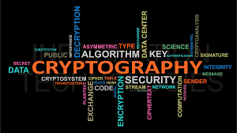

# Task_01
### Một số khái nhiệm cơ bản trong Cryptography
#### 1. Cryptography (mật mã học) 

- Cryptography (mật mã học) là một lĩnh vực liên quan đến các kỹ thuật ngôn ngữ và toán học để đảm bảo an toàn thông tin, cụ thể là trong thông tin liên lạc. Trong lịch sử, mật mã học gắn liền với quá trình mã hoá để đảm bảo tính bí mật trong công tác tình báo, quân sự, ngoại giao,...; trong những năm gần đây, mật mã được áp dụng vào: chữ ký số, bầu cử điện tử hay tiền điện tử,...

- Ví dụ : Mã morse, mật mã Caesar, etc…

#### 2. Cryptanalysis (phân tích mật mã) 

- Cryptanalysis (phân tích mật mã) là ngành học nghiên cứu các phương thức để thu được ý nghĩa của thông tin đã được mã hóa. Điều này liên quan đến việc tìm khóa bí mật. Trong ngôn ngữ không kĩ thuật, đây là việc codebreaking hoặc là bẻ khóa code, mặc dù những cụm từ này cũng có một ý nghĩa kỹ thuật đặc biệt.

- Ví dụ : trong chiến tranh việc phân tích mật mã của địch có khả năng biết được chiến thuật của địch, tránh được những tổn thất quân ta và làm quân địch bất ngờ

#### 3. Encode/Decode

- Encode và Decode là những khái niệm dùng để chỉ đến việc chuyển đổi dữ liệu cho hai mục đích khác nhau lưu trữ và sử dụng.

- Encode thông thường sẽ tạo ra dữ liệu phục phụ cho việc lưu trữ, ngược lại Decode sẽ chuyển đổi dữ liệu lưu trữ thành dữ liệu sử dụng trong chương trình. Hai quá trình này ngược nhau và khác nhau trong từng hệ ứng dụng, cách thức cài đặt, dữ liệu,…

- Ví dụ : Chuyển đổi từ hex sang decimal, từ chữ sang số (ASCII),từ Base 64 sang Base 32,…

#### 4. Encrypt/Decrypt

- Thuật ngữ mã hóa dữ liệu (Data Encrypt) mô tả việc làm cho dữ liệu không thể đọc được đối với người hoặc máy tính khác mà nếu không được phép (không nên nhìn thấy nội dung). Dữ liệu được mã hóa được tạo bằng chương trình mã hóa như PGP, máy mã hóa hoặc khóa mật mã đơn giản và xuất hiện dưới dạng rác cho đến khi được giải mã. Để đọc hoặc sử dụng dữ liệu, dữ liệu phải được giải mã và chỉ những người có mật khẩu hoặc khóa giải mã chính xác mới có thể đọc lại dữ liệu.

- Bản chất của quá trình mã hóa thông tin dữ liệu là chuyển đổi dữ liệu từ dạng này sang dạng khác bằng thuật toán nào đó, chỉ có người có quyền truy cập vào khóa giải mã hoặc có mật khẩu mới có thể đọc được dữ liệu này. Dữ liệu được mã hóa thường gọi là ciphertext (bản mã), không được mã hóa thì gọi là plaintext (bản thường)

- Chú ý phân biệt với Encode: Encode là quá trình đưa thông tin vào máy tính để lưu trữ, xử lý được thông tin, thông tin phải biến đổi thành dãy bit nhị phân để máy tính có thể hiểu và lưu trữ được. Còn Mã hóa dữ liệu là việc xử lý các dạng dữ liệu đã được nhập vào máy tính.

-  So sánh với Encode bên trên thì chúng ta chỉ cần dùng đúng công cụ encode để decode ngược lại là xong. Nhưng với Encrypt, quá trình mã hoá sẽ kèm theo secret key hay mã bảo mật mà chỉ người tạo và người được nhận mới biết chính xác được.

- Giải mã (Decrypt) là quy trình ngược lại so với mã hóa, tức là lấy dữ liệu được mã hóa và chuyển đổi lại thành dữ liệu mà con người hoặc máy tính có thể đọc và hiểu. Thuật ngữ này có thể được sử dụng để mô tả phương pháp giải mã dữ liệu theo cách thủ công hoặc giải mã dữ liệu bằng các mã hoặc khóa thích hợp. Dữ liệu có thể được mã hóa để khiến ai đó khó lấy cắp thông tin. Một số công ty cũng mã hóa dữ liệu để bảo vệ chung cho dữ liệu công ty và bí mật thương mại. Nếu dữ liệu này cần có thể xem được, nó có thể yêu cầu giải mã.

- Một hệ mật mã là một bộ gồm 5 thành phần ($\mathcal{P}$, $\mathcal{C}$, $\mathcal{K}$, $\mathcal{E}$, $\mathcal{D}$), trong đó :
- $\mathcal{P}$ là tập hữu hạn các thông báo rõ có thể
- $\mathcal{C}$ là tập hữu hạn các bản mã tương ứng
- $\mathcal{K}$ là tập hữu hạn các khóa có thể (hay được gọi là không gian khóa)
- $\mathcal{E}$ là tập các quy tắc mã hóa, tương ứng với một $k \in \mathcal{K}$
- $\mathcal{D}$ là tập tất cả các quy tắc giải mã, tương ứng với mỗi quy tắc mã $E_{k} \in \mathcal{E}$. Thực tế, $\mathcal{D}$ là tập tất cả các hàm ngược $D_{k}$ của hàm mã hóa $E_{k} \in \mathcal{E}$

#### 5. Symmetric/Asymmetric
- Symmetric
  - Là những hệ mật được sử dụng chung 1 khóa trong quá trình mã hóa và mã hóa. Do đó khóa phải được giữ bí mật tuyện đối.

  

  - Một số hệ mật mã khóa đối xứng hiện đại mà mình thấy hay được sử dụng là DES, AES, RC4, RC5,...
- Asymmetric
  - Vấn đề đối với các hệ mã đối xứng đó là rất khó để trao chuyển khóa một cách bí mật và các khóa thường gắn liền với một phiên làm việc. Do đó rất khó để quản lý khóa, hơn nữa hệ mã đối xứng không cung cấp cho chúng ta cơ chế chữ ký điện tử.

  - Vì vậy, các hệ mã khóa công khai đã ra đời để giải quyết các vấn đề trên, ý tưởng của hệ mã khóa công khai đó là mỗi khóa sẽ gắn liền với một người sử dung (thay vì gắn liền với một phiên làm việc giữa 2 người dùng). Trong hệ mã khóa công khai, khóa sẽ bao gồm một bộ gồm 2 khóa PK (Public Key) và SK (Secret Key). Tin nhắn mã hóa với khóa PK sẽ được giải mã với khóa SK và ngược lại. Khóa PK sẽ được công khai, vì vậy ai cũng có thể sử dụng khóa đấy để mã hóa rồi gửi tin nhắn bí mật cho A, nhưng chỉ có A mới có thể giải mã tin nhắn đó (do chỉ có A mới có khóa SK).

  - Sơ đồ chung của hệ mã như sau:
    + $E(m,PK) = c$
    + $D(c,SK) = m$
    
  - vd: RSA,...

  - So với các hệ mã hóa đối xứng, thì hệ mã hóa bất đối xứng có tốc độ tính toán chậm hơn rất nhiều. Vì vậy, người ta thường dùng hệ mã bất đối xứng để vận chuyển khóa bí mật, sau đó phiên làm việc sẽ được mã hóa trên khóa chung này (sử dụng các hệ mã đối xứng).

#### 6. Stream Ciphers/Block Ciphers
- Hệ mật mã dòng (Stream Ciphers) là một lớp rất quan trọng của hệ thống mật mã đối xứng. Chúng mã hóa từng ký tự (hoặc các số nhị phân) của bản thông báo một cách đồng thời bằng phép biến đổi mật mã theo thời gian. Trong lúc đó, hệ mật mã khối thực hiện mã hóa từng nhóm ký tự một của bản thông báo bằng phép biến đổi mật mã cố định. 
- Mật mã dòng nói chung có tốc độ mã hóa/ giải mã nhanh hơn mật mã khối trong phần cứng và có các mạch nối với nhau trong phần cứng ít phức tạp. Hơn nữa, các thuật toán mã hóa/giải mã được giữ bí mật tuyệt đối, ngoài khóa mã/giải mã của chúng. Do đó, mật mã dòng có độ an toàn rất cao là vì vậy, chúng được dùng để bảo mật thông tin trong Quân sự, An ninh, Ngoại gia,... Loại mật mã dòng này rất thích hợp trong nhiều hoàn cảnh, thậm chí trong một số trường hợp được coi là bắt buộc phải dùng chúng, ví dụ: trong thông tin liên lạc vệ tinh. Đặc biệt, mật mã dòng còn có nhiều ưu việt trong thông tin liên lạc trên kênh có sai số cao (kênh có nhiễu). Nhược điểm chủ yếu cuả hệ mật mã dòng là chúng thực hiện trong phần cứng nên giá thành của các hệ mật này là rất cao. Do vậy, mật mã dòng chủ yếu được dùng trong môi trường có độ bảo mật rất cao như để bảo vệ các thông tin có tính chiến lược.

- vd: One Time Pad, LSFR, PRNG,...

- Các hệ mã khối, giống như tên gọi, thực hiện tính toán trên từng khối bit có kích thước cố định, thông thường là 64 hoặc 128 bit. Vì vậy khi đầu vào bản rõ có độ dài không là bội số của khối, ta cần phải thực hiện thao tác đệm (padding) sao cho số bit của đầu vào phải là bội số của khối. Các hệ mã khối nổi tiếng đó là DES có kích thước khối là 64 (tức là mỗi lần mã hóa một khối bản rõ 64 bits và cho ra khối bản mã 64 bít) và kích thước khóa là 56 bits; AES có kích thước khối là 128 bit, và kích thước khóa là 128, 192 hoặc 256bit.
- Thông thường block cipher chậm hơn so với stream cipher, nhưng làm việc tốt với những khối dữ liệu đã biết trước kích thước, ví dụ mã hóa file, mã hóa tin nhắn trên các giao thức như là HTTP ...

- vd: DES, 3DES, AES,...

#### 7. Hash funtion
- #### giới thiệu

  - Các thuật toán xác thực và chữ ký số thường nhận các giá trị đầu vào là một dòng có độ dài là 64, 128 bits,...
  - Các thông báo cần ký thường có độ dài khác nhau và khá lớn(cỡ vài KB hoặc nhiều khi lên đến vài MB)
  - Như vậy, các bản tin được cắt ra thành nhiều đoạn có độ dài cố định rồi tiến hành ký trên từng đoạn một cách độc lập. Nếu giải quyết theo phương án này thì sẽ xuất hiện nhiều vấn đề sau:
    + Một là, tốc độ thực hiện sẽ rất chậm vì phải ký trên quá nhiều đoạn.
    + Hai là, khi sắp xếp lại, rất dễ xảy ra trường hợp thông báo không được sắp xếp đúng trật tự ban đầu của thông báo.
    + Ba là, rất dễ xảy ra trường hợp có một vài đoạn bị mất trong quá trình truyền tin. Nếu vấn đề thứ hai và thứ ba xảy ra thì chúng ta gặp phải tình huống xấu và khó khăn trong việc khôi phực lại nội dung của thông báo ban đầu. Trong thực hành người ta không chấp nhận các thực trạng trên.
  - Do đó, các nhà khoa học đã đưa ra giải pháp khắc phục. Đó là ứng dụng hàm Hash. Hàm Hash hay còn gọi là hàm băm, sẽ biến đổi từ một tài liệu bất kỳ thành một thông báo rút gọn có độ dài cố định và đủ ngắn, sau đó dùng lược đồ chữ ký để ký trên thông báo rút gọn đó thay vì phải ký trên tài liệu dày cộp.
- #### Định nghĩa
  - Hàm Hash (Hash funtion) là một hàm tính toán có hiệu quả khi ánh xạ các dòng nhị phân có độ dài tùy ý thành các dòng nhị phân có độ dài cố định trước và được ký hiệu là $h$.

  - Hàm Hash được gọi là có tính chất yếu, nếu cho trước một thông báo $x$ bất kỳ, thì về mặt tính toán không thể tìm được một thông báo $x' \neq x$ sao cho: 
      - $h(x') = h(x)$

  - Hàm Hash được gọi là mạnh nếu về mặt tính toán, không thể tìm ra được hai thông báo $x$ và $x'$ với $x' \neq x$ sao cho $h(x') = h(x)$. Trong trường hợp này ta nói là hàm Hash có một va chạm (Collision) nếu hàm Hash vi phạm tính chất mạnh.

  - Hàm Hash được gọi là có tính chất 1 chiều nếu cho trước thông báo đã được rút gọn z thì về mặt tính toán khó có thể xác định được x sao cho $h(x) = z$
  - Hàm Hash yếu làm cho chữ ký số trở nên tin cậy giống như ký trên toàn bộ thông báo
  - Còn hàm Hash mạnh có tác dụng chống lại kẻ giả mạo muốn tạo ra 2 thông báo có nội dung khác nhau, sau đó nhận được chữ ký hợp pháp cho một bản thông báo dễ được người ta chấp nhận rồi lấy nó để giả mạo làm chữ ký của thông báo thứ hai.
  - vd: MD2, MD4, MD5, SHA-256,...
