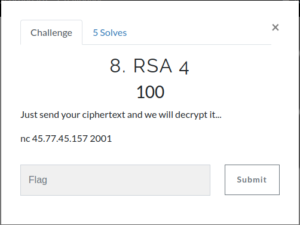
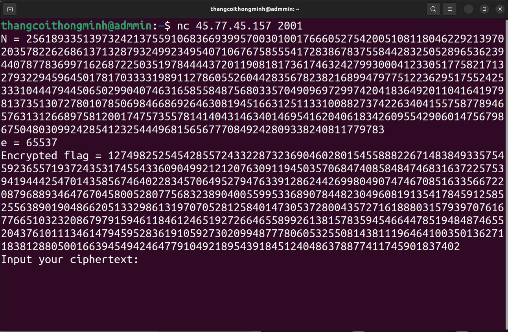

# KCSC - Write-ups RSA

### 1. RSA 01
- Challlenge cho file key.pem và ciphertext:
- Dựa vào file key.pem ta có thể lấy được key rồi từ đó có thể lấy được n và d, sau đó ta đọc file nhị phân ciphertext và lấy được c
```python3
from Crypto.PublicKey import RSA
from Crypto.Util.number import *
f = open('key.pem','r')
key = RSA.import_key(f.read())
cipher = bytes_to_long(open('ciphertext', "rb").read())
print("n = ",key.n)
print("d = ",key.d)
print("c = ",cipher)
# n =  21912489841733511794698106580063485470250594055187462788198187652767607854314252998211747886351110879321253201689061452197977488806358084074055368340402424971494727881746681954593621466433663689786472526177145448460397841352421716322273432060773491995531285561258506966449987174543171232978979442099552493561966527022719809451713843828784469032822929722065643944506775028124915604616104614202123011504714250041395235123309755323931011963576829166728067652325369336249432209671202729744216769870925456655158654025107541258067761216382765699036292345983613661678509665131916476718102130466973640442727738449125828144181
# d =  2060650718580157873291482684034808845411011126867660282129854133127424873993685592158304826256473922522312824928358860430617133241717892304451083214348142047115662258083112982809038382284470035041625476083469873711129254253919317024975256559405421494997617621230637720446891312623815838777678993539584539619908272397654888693245277722805216342030160661386091552816457208151602868794148375336155235550986401035639354094213314543112167631540373850869916276842778392457669462409759219797669073452458997438495119657644953879311118917495369984241594890260868650811011836555827451616450320694335563834185430351457366128803
# c =  7828830597845974472960864360220068027051793034442577921268081739573691626516375480253030776049811698684764954756075444237072169919047926933559013562260140593080619795444123120854917581170386200198951669814086627741971040701362123581301598544684321748343090709261259612948364056837830972972238953331881166908714205644431180950198456098343706556311605679821846500784840253240557721699773737970140139819388079736712155092847796363952027358566530235559200228160054492807242043102064533242237004766480746480958535308780310269935581113850515662782962794270766545622578571378608547102294854092443276124162573740915002493766
```
Mọi thứ đã trở nên đơn giản khi đã có đủ n, d, c

```python3
from Crypto.PublicKey import RSA
from Crypto.Util.number import long_to_bytes, bytes_to_long
f = open('key.pem', 'r')
key = RSA.import_key(f.read())

a = open('ciphertext','rb')
cipher = a.read()
dkey = key.d
nkey = key.n
msg = pow(bytes_to_long(cipher), dkey, nkey)
print(long_to_bytes(msg))
```
output:


- flag: KCSC{G00d_j0b_!!!______RSA_RSA_RSA}

### 2. RSA 02
- Challenge cho file small_primes.txt:
```
n = 9535271629301589543980737788527614014746809465076973703910968482522722398246280610827753553656401385478044310802319122874965273190562705759366029705507
e = 65537
c = 4552577387909336101290973882061311505705840831095295560114130894123462456438533356021283525714896620886904381766963261172543338282153176336375423711746
```

- Mới nhìn vào file là mình đã nghĩ đến việc tìm p, q bằng factordb nhưng mà không ra. Sau một hồi mày mò thì mình đã tìm được 1 tool khác [ở đây](https://www.alpertron.com.ar/ECM.HTM) và phân tích số n thành tích của 8 số nguyên tố khác nhau:

```
p1=809378587157807839
p2=7386670803860734511
p3=7844836778895444071
p4=8746422467282253197
p5=8958860398532938877
p6=10933341879030203071
p7=13937745649330813241
p8=17026289712509249947
```
- Sau khi factor được n mình sẽ tính được phi một cách dễ dàng:

`` phi=(p1-1)*(p2-1)*(p3-1)*(p4-1)*(p5-1)*(p6-1)*(p7-1)*(p8-1)
``

- Sau khi có được $\phi(n)$ thì mình decrypt giống như bình thường:

```python3
from Crypto.Util.number import long_to_bytes

n = 9535271629301589543980737788527614014746809465076973703910968482522722398246280610827753553656401385478044310802319122874965273190562705759366029705507
e = 65537
c = 4552577387909336101290973882061311505705840831095295560114130894123462456438533356021283525714896620886904381766963261172543338282153176336375423711746
p1 = 809378587157807839 
p2 = 7386670803860734511
p3 = 7844836778895444071
p4 = 8746422467282253197
p5 = 8958860398532938877
p6 = 10933341879030203071
p7 = 13937745649330813241
p8 = 17026289712509249947
phi = (p1-1)*(p2-1)*(p3-1)*(p4-1)*(p5-1)*(p6-1)*(p7-1)*(p8-1)
d = pow(e,-1,phi)
msg = long_to_bytes(pow(c,d,n))
print(msg)
```
- output:


- flag: KCSC{sm4ll_pr1m3s_RSA}

### 3. RSA_3

- Challenge cho file rsa.py:
```python3
#!/usr/bin/python3
 
 
from Crypto.Util.number import getPrime, long_to_bytes, bytes_to_long
 
p = getPrime(1024)
q = getPrime(1024)
n = p*q
e1 = 65537
e2 = 75149
 
flag = b"KCSC{??????????????????????????????}"
flag = bytes_to_long(flag)
 
 
print("n =", n)
print("e1 =", e1)
print("e2 =", e2)
print("c1 =", pow(flag, e1, n))
print("c2 =", pow(flag, e2, n))
print(long_to_bytes(flag).decode('ascii'))
 
"""
n = 15579041570549183877401062883225064299178659043622586326963894017668885771169636712942686974999467879138974673149238487346310183336299089723487535740955948164498209901918300643614745826133137188932678606032108627681713691545274099467785963695418741480158320568510332737549597969492465647544816476555527239578233498209294274834241435820100991805128484208187048402940657482492065868157791190013243763420906365240091105428192424185460937658483639186279855483707861986225957226824310616917954908062532412789164114438795637888280201795046396416617689806171608152291471471949544980200060392170827892405521363533899736434247
e1 = 65537
e2 = 75149
c1 = 958526646277295724168009763547786278668380497329915140390103080680844142220311835231176539706940958185703282540090844790805926548562491707936898169971263214280928361192803914900711720516558785577328679478102652166699188348694283992899346710699398385080627647392716832230871696605207075465964043078170464673712948247266791210646386374224164686149805328815931460563641454551397839079551430437448424836655869893565997221053407805155266300105570480915918775573741222285317386894157207021041886667232226686999026179007570092208455517449469430164063484188279221791507821580835493377236195443037703666043783154843296991980
c2 = 3364518837513546914916005862604690518243236022813143522634472702326113779354144548308524567399600026328302880849426586750023085953031035137263786380775479526123612089514173828715534956705435799574041315156819482550812270343681022195190739255746660599014578195344360880947115223661898250852906842786202954907911849356980822061691461413625527967303128318228029968148086918927848492525738193529285664626595877347027761575638243519289812130710352217003140546189017707851552139715658490173123320649047145805707417652762434393193118047679875378528913314061444052618140209949527982609241727893221732721184392506829957203306
"""
```

- Ta được cung cấp 2 đoạn ciphertext $(c_1, c_2)$, đây cũng chính là mã hoá của flag, trong đó $c_1$ là mã hoá của flag với khoá công khai $(n, e_1)$ và $c_2$ là mã hoá của flag với khoá công khai $(n, e_2)$. Có thể suy ra đây là dạng tấn công Common modulus:

- Ta có:

$$
c_{1} = m^{e_{1}} \bmod n
$$
$$
c_{2} = m^{e_{2}} \bmod n
$$
Sau đó tính $gcd(e_{1},e_{2})=d$, và tồn tại một cặp số $a, b$ sao cho:

$$
e_{1}a+e_{2}b=d
$$

- Khi đó:
$$
c_{1}c_{2} = (m^{e_{1}})^{a}(m^{e_{2}})^{b} = m^{e_{1}a+e_{2}b} = m^{d}
$$

- Từ đó chúng ta sẽ thu được flag một cách dễ dàng:

``solve.py``

```python3
from Crypto.Util.number import long_to_bytes
from libnum import *
n = 15579041570549183877401062883225064299178659043622586326963894017668885771169636712942686974999467879138974673149238487346310183336299089723487535740955948164498209901918300643614745826133137188932678606032108627681713691545274099467785963695418741480158320568510332737549597969492465647544816476555527239578233498209294274834241435820100991805128484208187048402940657482492065868157791190013243763420906365240091105428192424185460937658483639186279855483707861986225957226824310616917954908062532412789164114438795637888280201795046396416617689806171608152291471471949544980200060392170827892405521363533899736434247
e1 = 65537
e2 = 75149
c1 = 958526646277295724168009763547786278668380497329915140390103080680844142220311835231176539706940958185703282540090844790805926548562491707936898169971263214280928361192803914900711720516558785577328679478102652166699188348694283992899346710699398385080627647392716832230871696605207075465964043078170464673712948247266791210646386374224164686149805328815931460563641454551397839079551430437448424836655869893565997221053407805155266300105570480915918775573741222285317386894157207021041886667232226686999026179007570092208455517449469430164063484188279221791507821580835493377236195443037703666043783154843296991980
c2 = 3364518837513546914916005862604690518243236022813143522634472702326113779354144548308524567399600026328302880849426586750023085953031035137263786380775479526123612089514173828715534956705435799574041315156819482550812270343681022195190739255746660599014578195344360880947115223661898250852906842786202954907911849356980822061691461413625527967303128318228029968148086918927848492525738193529285664626595877347027761575638243519289812130710352217003140546189017707851552139715658490173123320649047145805707417652762434393193118047679875378528913314061444052618140209949527982609241727893221732721184392506829957203306

def common_modulus(e1,e2,c1,c2,n):
    a, b, c = xgcd(e1,e2)
    if a<0:
        a = -a
        c1 = pow(c1,-1,n)
    if b<0:
        b = -b
        c2 = pow(c2,-1,n)
    m = long_to_bytes(pow(c1,a,n)*pow(c2,b,n)%n)
    print(m)

common_modulus(e1,e2,c1,c2,n)
```

- flag: KCSC{_c0mm0n_m0dulus_______________}

### 4. RSA_4

- Đề bài như sau:



- Server cho N, e và Encrypted flag, và mình cần gửi bản mã của mình vào để server decrypt theo công thức:

$$
m = c^{d} \bmod n
$$



- Vì server sẽ từ chối decrypt $c =$ Encrypted flag, nên mình sẽ phải nhân $c$ với 1 số $r^e$ nào đó sao cho:

$$
(cr^{e}) \bmod n
$$

- Server sẽ thực hiện decrypt:
$$
h = (cr^{e}) \bmod n = (m^{e}r^{e})^{d} = (m^{ed}r^{ed}) \bmod n = mr \bmod n 
$$

$$
\implies m = \frac{h}{r} \bmod n
$$

- Từ đó mình sẽ thu về flag

``sol.py``

```python3
from Crypto.Util.number import *
from pwn import *
io = remote('45.77.45.157', 2001)
io.recvuntil(b'N = ')
n = int(io.recvuntil(b'\n').decode())
io.recvuntil(b'flag = ')
c = int(io.recvuntil(b'\n').decode())
e = 65537
k = (c * pow(2,e)) % n
  
io.sendline(str(k).encode())
io.recvuntil(b'is ')
h = int(io.recvuntil(b'\n').decode())
print(long_to_bytes(h//2))
io.interactive()
```

- flag: KCSC{ch0sen_c1phertext_4tt4ck}

### 5. RSA 05
- Đề bài cho file Wiener-attack.txt:

```
n = 4132976885313620989793138232237857485698296237464660843315969036074678733191191577685180205697480631542751907366655945998120743803779982256919952243360171622255710620255448449934374799426944976112754122373672543300475307874859246944968687601079412328357824701323041241341274623879229479225565485630084007195867934589763500476352488857570266688948676558779645051259275472615017031239454654649250067852440038216514254375247334297284709102711047491074903964306850091668210467313746721
e = 1750050028811042317092326965718758083501771847947887293515411772102890164760552659457975064653911340940187822648462652483456640570963224225417353368313169226726553908832781209174212992300450276992090024394416526941239015616616221568602574848593841017150941057063859910043814071580107820286653129237982205855538973817418438652522623026562425971136775219067133693665110372249308179365513518843406292774596623071641859580717087301634730699160968730685078033151203026378458630658027183
c = 281833041089031329877955708537883567595102587735700060795910832047971578904265919004493566623179634029899784120656782497079401966828978655173874757033079671295302908540302580553411001062296038906480815096344660583927786701256080412482545291031999575562354075125133028508948916979768605898769848805716444664173353566191136536691509637139284690177133420104271519555154357534379993283611943343212541981157950089731344739020706609848032078220759256353608507103460929949946267236256484
```

- Mình để ý thấy số mũ công khai $e$ lớn hơn bình thường và dựa vào tên file nên biết đây là kiểu tấn công Wiener attack
- Mình sử dụng script có sẵn để tìm ra $p,q,d$ dựa vào $n,e$:


``wiener-attack.py``

```python3
import sys
from sympy.solvers import solve
from sympy import Symbol

# A reimplementation of pablocelayes rsa-wiener-attack for this purpose
# https://github.com/pablocelayes/rsa-wiener-attack/


class WienerAttack(object):
    def rational_to_contfrac(self, x, y):
        a = x // y
        if a * y == x:
            return [a]
        else:
            pquotients = self.rational_to_contfrac(y, x - a * y)
            pquotients.insert(0, a)
            return pquotients

    def convergents_from_contfrac(self, frac):
        convs = []
        for i in range(len(frac)):
            convs.append(self.contfrac_to_rational(frac[0:i]))
        return convs

    def contfrac_to_rational(self, frac):
        if len(frac) == 0:
            return (0, 1)
        elif len(frac) == 1:
            return (frac[0], 1)
        else:
            remainder = frac[1:len(frac)]
            (num, denom) = self.contfrac_to_rational(remainder)
            return (frac[0] * num + denom, num)

    def is_perfect_square(self, n):
        h = n & 0xF
        if h > 9:
            return -1

        if (h != 2 and h != 3 and h != 5 and h != 6 and h != 7 and h != 8):
            t = self.isqrt(n)
            if t*t == n:
                return t
            else:
                return -1

        return -1

    def isqrt(self, n):
        if n == 0:
            return 0
        a, b = divmod(n.bit_length(), 2)
        x = 2**(a+b)
        while True:
            y = (x + n//x)//2
            if y >= x:
                return x
            x = y

    def __init__(self, n, e):
        self.d = None
        self.p = None
        self.q = None
        sys.setrecursionlimit(100000)
        frac = self.rational_to_contfrac(e, n)
        convergents = self.convergents_from_contfrac(frac)

        for (k, d) in convergents:
            if k != 0 and (e * d - 1) % k == 0:
                phi = (e * d - 1) // k
                s = n - phi + 1
                discr = s*s - 4*n
                if(discr >= 0):
                    t = self.is_perfect_square(discr)
                    if t != -1 and (s + t) % 2 == 0:
                        self.d = d
                        x = Symbol('x')
                        roots = solve(x**2 - s * x + n, x)
                        if len(roots) == 2:
                            self.p = roots[0]
                            self.q = roots[1]
                        break


def main():
    n = 4132976885313620989793138232237857485698296237464660843315969036074678733191191577685180205697480631542751907366655945998120743803779982256919952243360171622255710620255448449934374799426944976112754122373672543300475307874859246944968687601079412328357824701323041241341274623879229479225565485630084007195867934589763500476352488857570266688948676558779645051259275472615017031239454654649250067852440038216514254375247334297284709102711047491074903964306850091668210467313746721
    e = 1750050028811042317092326965718758083501771847947887293515411772102890164760552659457975064653911340940187822648462652483456640570963224225417353368313169226726553908832781209174212992300450276992090024394416526941239015616616221568602574848593841017150941057063859910043814071580107820286653129237982205855538973817418438652522623026562425971136775219067133693665110372249308179365513518843406292774596623071641859580717087301634730699160968730685078033151203026378458630658027183
    Wiener = WienerAttack(n,e)
    print('d =', Wiener.d)
    print('p =', Wiener.p)
    print('q =', Wiener.q)


if __name__ == '__main__':
    main()
```
- Và mọi thứ đã trở nên đơn giản hơn khi có $c, d, n$:

``sol.py``
```python3
from Crypto.Util.number import long_to_bytes
d = 716190187
n = 4132976885313620989793138232237857485698296237464660843315969036074678733191191577685180205697480631542751907366655945998120743803779982256919952243360171622255710620255448449934374799426944976112754122373672543300475307874859246944968687601079412328357824701323041241341274623879229479225565485630084007195867934589763500476352488857570266688948676558779645051259275472615017031239454654649250067852440038216514254375247334297284709102711047491074903964306850091668210467313746721
c = 281833041089031329877955708537883567595102587735700060795910832047971578904265919004493566623179634029899784120656782497079401966828978655173874757033079671295302908540302580553411001062296038906480815096344660583927786701256080412482545291031999575562354075125133028508948916979768605898769848805716444664173353566191136536691509637139284690177133420104271519555154357534379993283611943343212541981157950089731344739020706609848032078220759256353608507103460929949946267236256484
msg = long_to_bytes(pow(c,d,n))
print(msg)
```
- flag: KCSC{Wiener's_attack__and__the_continued_fraction_method}

### 6. RSA 06

Đề bài cho file rsa_broadcast1.txt:

```
e = 3
n1 = 15211798436362885588723897472623293108591910720248957088525019147693538931418263644191188384087192671444613094034228918351752803921214902780115562729109781194564524730616678647299169668840956022253982803940312167051028025651451365086567411697105580823877496322214373858833329503752687389688721464285614416771633832582443831661924525300740587474479915929822185275968765754620639022007556456154273657783836757234869195977992123246001228697364075063631187467467697745958645305050039195409454420883812093851985406438672509679246467362469273159499487930727024310388797737943309901526797320729580549192841964736229600813437
n2 = 21626591969748724512355177924918151334158692957275724877201419607370019278469828125430933124647057504933171869087241002295484088598636458608105322242001060441558558278797676461391977116810622817635779677982150953706982381323844252445458244135760020640138808906951682479395863864919549962007373607664366817674762287851196714326243612440231068277212588495380690697891854959356395382045100868123379468012270186296103993203562175010292310086073927253450438086216611208684799637796464261482073508874703244824884346950888805872923441649245961999831565337681569234397762306502810178342042653449265916866561749583475708506489
n3 = 19097512400706369325816400961039266520829132024949428791526363177058945505751899029358156804216166758940650597868797785258374150813571509380064038840061726644717439998319734158962470548255317210745880084736970984390975595882829502051653319165598723830478149695519141929068772902346767236824342095368037621017207832466086004587771992170123884424073079485433784440021512429824282637400305642774699534138130348712885010916063585549753598230434385619415390706485902887757182780700303004691590541073975281734461423828352816003269155485065897617967030890926979120590779492197580892502646039371764232471906522526296219044183
c1 = 3251198529556591276640909876291141541737775776637150826274246892380018296361827635107478892116516384634504571893928896554767181567637566254415357054493250586599382503595829321201216536132199851851618953852014243314378960676373786613246133182982555838167962717812421434737360297550708423100886906991055921147284735674702176413796610353804517146466379878388359517757702427076082967853155861099707602779621105223657419322088524733685896548987843869707507601904751483232766421541178894496409959520397121463742851694646049947955175502597943566531090437882873905976886981851527484314251722489360942946805553642641785533871
c2 = 15135217823526097772519900957933040202807636182314280311189695893431054786303987708413474068415707150513323386429214635854762776745555347371832883008219672632749941935077295393195697128178492924391678205067775743757767823864584237860003012359695072221700711595856530791714211924064550268243631243362766987128956040475445498266176256225045064611375849108128270761940506410647731412975500973418593459625869469510858206856760736855983352421016179474694787887698754428107461346078193499703174230170749626788692302178224413858188847383010551271438663317946456212396542276796630964988477451722975130905027330444176318042328
c3 = 15355054927350813303626858433403916623058859059252777554479910220092612925381550409545199089214160097848435742400812973625531286808230922571593810018171046879915634188717607339504062256793383771946376984232533453731145028391895516576634761731653648183572968742139920212951333594010550127064134533054100929996820183698904676540298678839115953892905947613857277985039554670042470713722826404341171096982285681133879305459751292317392125967997245763135235288243153509814572254592078683963265503724069453798934980668326437279129145084847542959442317212953913062182429893663058924717141868300505345393715099015666896636500
```

- Ta thấy đây là dạng bài Hastad’s Broadcast attack, flag được mã hoá nhiều lần với số mũ nhỏ $(e = 3)$, ta có:

$$m^3 ≡ c_{1} \bmod n_{1}$$
$$m^3 ≡ c_{2} \bmod n_{2}$$
$$m^3 ≡ c_{3} \bmod n_{3}$$

- Áp dụng Định lý phần dư Trung Hoa (crt) ta có thể tính ra được $m^3$ và từ đó có thể lấy được flag:

``sol.py``

```python3
from Crypto.Util.number import long_to_bytes
from gmpy2 import iroot

def crt(remainders, modules):
    assert len(remainders) == len(modules)
    count = len(modules)
    N = 1
    for n in modules:
        N *= n
    
    Ni_list = []
    for i in range(count):
        Ni_list.append(N//modules[i])
    
    Mi_list = [] 
    for i in range(count):
        Mi_list.append(pow(Ni_list[i],-1,modules[i]))
    
    sum = 0
    for i in range(count):
        sum += remainders[i]*Ni_list[i]*Mi_list[i]
    x = sum % N
    m = long_to_bytes(iroot(x,3)[0])
    print(m)

e = 3
n1 = 15211798436362885588723897472623293108591910720248957088525019147693538931418263644191188384087192671444613094034228918351752803921214902780115562729109781194564524730616678647299169668840956022253982803940312167051028025651451365086567411697105580823877496322214373858833329503752687389688721464285614416771633832582443831661924525300740587474479915929822185275968765754620639022007556456154273657783836757234869195977992123246001228697364075063631187467467697745958645305050039195409454420883812093851985406438672509679246467362469273159499487930727024310388797737943309901526797320729580549192841964736229600813437
n2 = 21626591969748724512355177924918151334158692957275724877201419607370019278469828125430933124647057504933171869087241002295484088598636458608105322242001060441558558278797676461391977116810622817635779677982150953706982381323844252445458244135760020640138808906951682479395863864919549962007373607664366817674762287851196714326243612440231068277212588495380690697891854959356395382045100868123379468012270186296103993203562175010292310086073927253450438086216611208684799637796464261482073508874703244824884346950888805872923441649245961999831565337681569234397762306502810178342042653449265916866561749583475708506489
n3 = 19097512400706369325816400961039266520829132024949428791526363177058945505751899029358156804216166758940650597868797785258374150813571509380064038840061726644717439998319734158962470548255317210745880084736970984390975595882829502051653319165598723830478149695519141929068772902346767236824342095368037621017207832466086004587771992170123884424073079485433784440021512429824282637400305642774699534138130348712885010916063585549753598230434385619415390706485902887757182780700303004691590541073975281734461423828352816003269155485065897617967030890926979120590779492197580892502646039371764232471906522526296219044183
c1 = 3251198529556591276640909876291141541737775776637150826274246892380018296361827635107478892116516384634504571893928896554767181567637566254415357054493250586599382503595829321201216536132199851851618953852014243314378960676373786613246133182982555838167962717812421434737360297550708423100886906991055921147284735674702176413796610353804517146466379878388359517757702427076082967853155861099707602779621105223657419322088524733685896548987843869707507601904751483232766421541178894496409959520397121463742851694646049947955175502597943566531090437882873905976886981851527484314251722489360942946805553642641785533871
c2 = 15135217823526097772519900957933040202807636182314280311189695893431054786303987708413474068415707150513323386429214635854762776745555347371832883008219672632749941935077295393195697128178492924391678205067775743757767823864584237860003012359695072221700711595856530791714211924064550268243631243362766987128956040475445498266176256225045064611375849108128270761940506410647731412975500973418593459625869469510858206856760736855983352421016179474694787887698754428107461346078193499703174230170749626788692302178224413858188847383010551271438663317946456212396542276796630964988477451722975130905027330444176318042328
c3 = 15355054927350813303626858433403916623058859059252777554479910220092612925381550409545199089214160097848435742400812973625531286808230922571593810018171046879915634188717607339504062256793383771946376984232533453731145028391895516576634761731653648183572968742139920212951333594010550127064134533054100929996820183698904676540298678839115953892905947613857277985039554670042470713722826404341171096982285681133879305459751292317392125967997245763135235288243153509814572254592078683963265503724069453798934980668326437279129145084847542959442317212953913062182429893663058924717141868300505345393715099015666896636500
crt((c1,c2,c3),(n1,n2,n3))
```

- flag: KCSC{H4st4d's_bro4dc4st_4tt4ck}

### 7. RSA 07
- Challenge cho file rsa_broadcast2.txt:

```
e = 3
n1 = 23184700367690596303406550971928697673315695312120525291456094122743742010016226301759318172591899439376799808431685941527169796776570743899979298554409005480153307551428665749149948060630315726553523447633277065840678480457315050245040918863351241692825077299152872409567666573886374862312965387327079627891721566639535535296901623370762481713155628281232602588768627992242131939884638263075618744867111618723241992478956699889502912543123038633344429842749463260874052018112608941224856134564195347101056078761675907073360789141915885496838102884913576944025216977647088726652239424061138854393257556520240785344373
n2 = 16598614154706972613420271784041125815410748531927792645441917414795252248850438735450206608019760097831684217289403926030457577087296106956317039703951800836861403186216641885780852987165403401697525821473826262674886082931962185244493330904097197340110215380613208151944566195249874443613282112190739152189814826718021904731418965163730919542916269293435112103504280600213923559249751280865152404050874882009908096226969114758173139152709837189758453204197064328057840694362428909554382342827148993177283611306667670265691995707445776879457625204260502242548687534619027985025487711115404523481782960174504732857009
n3 = 18023432020300442738738062448416035717919461455011042240759145335434574003080342934635551455204032299361120919980695845642250348164536381756118840024408657214977332180398244581545784738124088948227145231355190757784051824978257570968860355941532904863315988162884103972768088720444842728795771351658266591483544109850462942678247121628487231978667969236923701711260500813287056433101477185900687648799589024395603183687507382390297084295802618279215173280355268385860909746021503791135390838338964209264691204955162908187234076148039007653550193682268845337566441530264439189646728237429160458816450762065954819949197
c1 = 19934568187928476786276353946230588770243780029393046823633486073116651015565544156952667387651523670076677357737577026596666960721288284894188043566698464072855090089235184233940149497318798665625122431143353156593956501282889994170921411044600563111916234521961536438600057251449574684717418423790754055164104219638041149135728268385432891715463709507718180865262213572972479595340149066835814970249340094158179221898945456036286830970613979695569820940406947016601241113925115751200967905260429763548927062510399413614863499539823627362380842906950943504657543582701473492996580652845453386712662826349611170206580
c2 = 1617683594404666548836359237923415612813045229127439214088865024693399205403200852884495967561973120511879065328005029057633814406551244379097818934242866988967424818284882849057297267451033013018026724388201387533109258717645941407763249264500936515282778221854712614496788452614266935110384768732822237225522839510097318986609605933219687361578669613186506784634199992122169637751031371708200620666214852169377245355301796062583474907463922465703036275828236511153741205732104680485530794799310780669751514259692578406932196562475251270759560037331934337880592480679752765350979468119968083637274756411442879530071
c3 = 11294304506729600643492116020962915989599615685356881631579837923021298134997850980524328941701787235510449288855678789005644641517388854058584793089515380093918545926130855131753008552625028747106361598884651052308887184081656660166586918875983114307100261860903346153858267745682732334481120243382849069450181538948120842052372224838952597147218031988257742726569418404945571245213934449101878947407417329374897702218685126587810292372931171655602204932567780440897050480588867286019859605172177334807006659550681497559165115728179233680905489143670526604513895006427544916907293701375794064498806702961492170073523
```

- Trông bài này khá giống với bài RSA 06 ở trên, nên mình cũng thử thay số vào nhưng mà không ra được flag :v
- Sau một hồi mày mò thì mình phát hiện ra:

$$gcd(n_{1}, n_{2}) \neq 1$$
$$gcd(n_{1}, n_{3}) \neq 1$$
$$gcd(n_{2}, n_{3}) \neq 1$$

- Điều này chỉ xảy ra khi từng cặp n dùng chung 1 số nguyên tố p nào đó, ý tưởng của bài này là:

$$p_{chung} = gcd(n_{1},n_{2})$$
$$\phi(n_1) = (p_{chung}-1)*(\frac{n_1}{p_{chung}}-1)$$

- Từ đó tính ra phi và suy ra flag:

``sol.py``

```python3
from Crypto.Util.number import long_to_bytes,GCD
from gmpy2 import iroot

# def crt(remainders, modules):
#     assert len(remainders) == len(modules)
#     count = len(modules)
#     N = 1
#     for n in modules:
#         N *= n
    
#     Ni_list = []
#     for i in range(count):
#         Ni_list.append(N//modules[i])
    
#     Mi_list = [] 
#     for i in range(count):
#         Mi_list.append(pow(Ni_list[i],-1,modules[i]))
    
#     sum = 0
#     for i in range(count):
#         sum += remainders[i]*Ni_list[i]*Mi_list[i]
#     x = sum % N
#     m = long_to_bytes(iroot(x,3)[0])
#     print(m)

e = 3
n1 = 23184700367690596303406550971928697673315695312120525291456094122743742010016226301759318172591899439376799808431685941527169796776570743899979298554409005480153307551428665749149948060630315726553523447633277065840678480457315050245040918863351241692825077299152872409567666573886374862312965387327079627891721566639535535296901623370762481713155628281232602588768627992242131939884638263075618744867111618723241992478956699889502912543123038633344429842749463260874052018112608941224856134564195347101056078761675907073360789141915885496838102884913576944025216977647088726652239424061138854393257556520240785344373
n2 = 16598614154706972613420271784041125815410748531927792645441917414795252248850438735450206608019760097831684217289403926030457577087296106956317039703951800836861403186216641885780852987165403401697525821473826262674886082931962185244493330904097197340110215380613208151944566195249874443613282112190739152189814826718021904731418965163730919542916269293435112103504280600213923559249751280865152404050874882009908096226969114758173139152709837189758453204197064328057840694362428909554382342827148993177283611306667670265691995707445776879457625204260502242548687534619027985025487711115404523481782960174504732857009
n3 = 18023432020300442738738062448416035717919461455011042240759145335434574003080342934635551455204032299361120919980695845642250348164536381756118840024408657214977332180398244581545784738124088948227145231355190757784051824978257570968860355941532904863315988162884103972768088720444842728795771351658266591483544109850462942678247121628487231978667969236923701711260500813287056433101477185900687648799589024395603183687507382390297084295802618279215173280355268385860909746021503791135390838338964209264691204955162908187234076148039007653550193682268845337566441530264439189646728237429160458816450762065954819949197
c1 = 19934568187928476786276353946230588770243780029393046823633486073116651015565544156952667387651523670076677357737577026596666960721288284894188043566698464072855090089235184233940149497318798665625122431143353156593956501282889994170921411044600563111916234521961536438600057251449574684717418423790754055164104219638041149135728268385432891715463709507718180865262213572972479595340149066835814970249340094158179221898945456036286830970613979695569820940406947016601241113925115751200967905260429763548927062510399413614863499539823627362380842906950943504657543582701473492996580652845453386712662826349611170206580
c2 = 1617683594404666548836359237923415612813045229127439214088865024693399205403200852884495967561973120511879065328005029057633814406551244379097818934242866988967424818284882849057297267451033013018026724388201387533109258717645941407763249264500936515282778221854712614496788452614266935110384768732822237225522839510097318986609605933219687361578669613186506784634199992122169637751031371708200620666214852169377245355301796062583474907463922465703036275828236511153741205732104680485530794799310780669751514259692578406932196562475251270759560037331934337880592480679752765350979468119968083637274756411442879530071
c3 = 11294304506729600643492116020962915989599615685356881631579837923021298134997850980524328941701787235510449288855678789005644641517388854058584793089515380093918545926130855131753008552625028747106361598884651052308887184081656660166586918875983114307100261860903346153858267745682732334481120243382849069450181538948120842052372224838952597147218031988257742726569418404945571245213934449101878947407417329374897702218685126587810292372931171655602204932567780440897050480588867286019859605172177334807006659550681497559165115728179233680905489143670526604513895006427544916907293701375794064498806702961492170073523
# print(GCD(n1,n2))
# print(GCD(n1,n3))
# print(GCD(n2,n3))

def phi_n(a,b):
    p = GCD(a,b)
    q = a//p
    return (p-1)*(q-1) 

phi_n1 = phi_n(n1,n2)
# phi_n2 = phi_n(n2,n3)
# phi_n3 = phi_n(n3,n1)
d1 = pow(e,-1,phi_n1)
# d2 = pow(e,-1,phi_n2)
# d3 = pow(e,-1,phi_n3)

msg1 = long_to_bytes(pow(c1,d1,n1))
# msg2 = long_to_bytes(pow(c2,d2,n2))
# msg3 = long_to_bytes(pow(c3,d3,n3))
print(msg1)
# print(msg2)
# print(msg3)
```

- Mình cũng đã thử cả 3 trường hợp và cả 3 đều ra flag

- flag: KCSC{Greatest_C0mm0n_Divis0r}