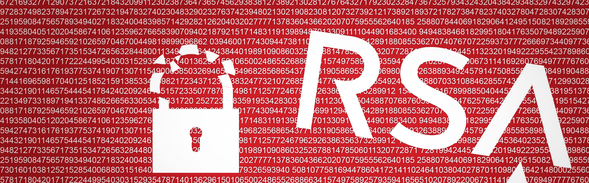

# Task_02
## RSA and RSA attacks

### 1. Giới thiệu
- Nguồn gốc
  + Thuật toán được Ron Rivest, Adi Shamir và Len Adleman mô tả lần đầu tiên vào năm 1977 tại Học viện Công nghệ Massachusetts (MIT). RSA là chữ viết tắt của tên 3 nhà sáng lập nên hệ mã này: Rivest–Shamir–Adleman.
- Hoạt động
  + RSA là một hệ thống mã hóa bất đối xứng (asymmetric cryptography – còn gọi là public-key cryptosystem) sử dụng một cặp key: public key dùng để mã hóa và private key dùng để giải mã. Hệ mã hóa RSA gồm 3 bước: Tạo key, Mã hóa và Giải mã.
  + Bước 1: Tạo key
    + Chọn 2 số nguyên tố lớn $p,q$ với $p ≠ q$
    + $$n = p \times q$$
    $$\phi(n) = (p-1) \times (q-1)$$
    + Chọn $e$ thỏa mãn : 1 < $e$ < $\phi(n)$ và $gcd(e,\phi(n)) = 1$
    + Tính $d = e^{-1} \bmod \phi(n)$, số $d$ thỏa mãn $ed \equiv 1 \bmod \phi(n)$
    + Mấu chốt cơ bản của việc sinh khóa trong RSA là tìm được bộ 3 số tự nhiên $e, d, n$ sao cho:
    $$m^{ed} \equiv m \pmod{n}$$
    + và một điểm không thể bỏ qua là cần bảo mật cho $d$ sao cho dù biết $e, n$ hay thậm chí cả $m$ cũng không thể tìm ra $d$ được
  + Bước 2 + 3: Mã hoá và Giải mã:
    + Trong phần này, chúng ta sẽ tìm hiểu cách mã hóa với public key $(n, e)$ và giải mã với private key $(n, d)$.

    + Nếu chúng ta có bản rõ $m$, chúng ta cần chuyển nó thành một số tự nhiên m trong khoảng $(0, n)$ sao cho $m, n$ nguyên tố cùng nhau. Việc này rất dễ dàng thực hiện bằng cách thêm một các kỹ thuật padding. Tiếp theo, chúng ta sẽ má hóa $m$, thành $c$ như sau:
    $$c \equiv m^{e} \bmod n$$
    + Sau đó giá trị c sẽ được chuyển cho người nhận. Ở phía người nhận, họ sẽ giải mã từ c để lấy được m như sau:
    + $$c^{d} \equiv m^{ed} \equiv m \bmod n$$
    + vd: 
    
    $$ p = 5, q = 7$$
    
    $$ n = p \times q = 35$$
    
    $$ \phi(n) = 24$$
    + Chúng ta chọn $e = 5$ vì $gcd(5, 24) = 1$, cuối cùng tính $d = e^{-1} \bmod \phi(n) = 29$
    + Giả sử $m = 32$, chúng ta sẽ mã hóa m và thu được:
    $$c = 32^{5} \bmod 35 = 2$$
    + Giải mã $c$ để thu được $m$:
    $$m = 2^{29} \bmod 35 = 32$$
    + Mức độ bảo mật của RSA phụ thuộc rất lớn vào khả năng phân tích thừa số nguyên tố của các số lớn. Bởi vì chúng ta cung cấp public một cách rộng rãi, nếu việc phân tích thừa số nguyên tố đơn giản, thì việc bị lộ private là không thể tránh khỏi.

    + Vì vậy, khi sinh khóa, chúng ta cần chọn các số nguyên tố p và q một cách ngẫu nhiên. Bản thân hai số nguyên tố này cũng rất lớn, và để việc phân tích thừa số nguyên tố khó khăn hơn, hai số nguyên tố này sẽ không có cùng độ dài. Trong tương lai gần, có lẽ vẫn chưa có một phương pháp hiệu quả nào cho phép thực hiện điều này với các máy tính cá nhân.

    + Một mã RSA tốt cần phải đảm bảo các điều sao đây:
        - 2 số p và q là 2 số nguyên tố lớn, ít nhất là 512 bit mỗi số.
        - n là một số semiprime lớn, ít nhất là 1024 bit, số semiprime là tích của đúng 2 số nguyên tố.
        - $gcd(e,\phi(n)) = 1$ và $e$ phải đủ lớn. Về cơ bản thì ta chỉ cần thỏa điều kiện $2 < e < n$ nên ta hoàn toàn có thể chọn e là 3, tuy nhiên, sẽ có trường hợp số e nhỏ có thể bị tấn công một cách dễ dàng. Mặt khác do $e.d \equiv 1 \bmod \phi(n)$ nên nếu e lớn quá thì $d$ sẽ nhỏ và người ta có thể dễ dàng tìm được giá trị của $d$. Vì thế, người ta thường chọn $e = 2^{16} + 1 = 65537$ vì nó đủ lớn và phép $c \equiv m^{e} \bmod n$ có thể được tính một cách dễ dàng.
        + Số $m$ cần gửi phải thỏa $n^{1/3} < m < n$ để tránh trường hợp số e nhỏ dẫn tới $m^e < n$.
### 2. RSA Attacks
- Một công cụ khá hữu dụng cho việc tấn công RSA trong CTF là RsaCtfTool https://github.com/Ganapati/RsaCtfTool  .

- Trong đó đã bao gồm rất nhiều cách tấn công (Weak public key factorization, Wiener’s attack, Hastad’s attack, Small q, Common factor between ciphertext and modulus attack, Fermat’s factorisation for close p and q, Gimmicky Primes method, Past CTF Primes method, Self-Initializing Quadratic Sieve,…)

- Trong bài viết này chúng ta sẽ tìm hiểu các cách tấn công: 𝐒𝐦𝐚𝐥𝐥𝐦𝐨𝐝𝐮𝐥𝐮𝐬, 𝐂𝐨𝐦𝐦𝐨𝐧 𝐦𝐨𝐝𝐮𝐥𝐮𝐬, 𝐇𝐚𝐬𝐭𝐚𝐝’𝐬 𝐛𝐫𝐨𝐚𝐝𝐜𝐚𝐬𝐭 𝐚𝐭𝐭𝐚𝐜𝐤, 𝐂𝐮𝐛𝐞-𝐫𝐨𝐨𝐭 𝐚𝐭𝐭𝐚𝐜𝐤, 𝐖𝐢𝐞𝐧𝐞𝐫’𝐬 𝐚𝐭𝐭𝐚𝐜𝐤, 𝐁𝐥𝐢𝐧𝐝𝐢𝐧𝐠 𝐚𝐭𝐭𝐚𝐜𝐤.

  - a. Small modulus
    - Lỗ hổng: số $n$ nhỏ. Giả sử số $n$ trong public key quá nhỏ thì ta có thể dễ dàng phân tích được $p$ và $q$ bằng các công cụ online như factordb http://factordb.com/ hoặc https://www.alpertron.com.ar/ECM.HTM. Từ 2 số $p$ và $q$ ta có thể tính được $\phi(n), d$ và giải mã.
  - b. Common modolus
    - Lỗ hổng: dùng cùng một số $n$. Giả sử Alice và Bob dùng cùng một số $n$ để tạo các key, như vậy, $(n, e_{1})$ là public key của Alice và $(n, e_{2})$ là public key của Bob với $gcd(e1, e2) = 1$. Chris gửi cùng một số m cho cả Alice và Bob, tức $c_{1} = m^{e_{1}} \bmod n, c_{2} = m^{e_{2}} \bmod n$.

    - Giả sử Eve muốn biết số m mà Chris đã gửi cho Alice và Bob. Do $gcd(e_{1}, e_{2}) = 1$ nên sẽ tồn tại 2 số $r, s$ sao cho $e_{1}r + e_{2}s = 1$. Khi đó Eve có thể tính được $m$ bằng cách tính $c_{1}^rc_{2}^s ≡ (m^{e_{1}})^r(m^{e_{2}})^s ≡ m^{e_{1}r + e_{2}s} ≡ m \bmod n$.
  - c. Hastad's broadcast attack (Small CRT-exponent): 
    - Lỗ hổng: số $e$ nhỏ và bằng số người nhận. Giả sử Alice gửi số $m$ cho 3 người Bob, Chris và David, public exponent của mỗi người là $e_{1} = e_{2} = e_{3} = 3$ và tất cả các số modulus $n_{i}$ đều đôi một coprime. Nói cách khác, $c_{1} ≡ m^{3} \bmod n_{1}, c_{2} ≡ m^{3} \bmod n_{2}, c_{3} ≡ m^{3} \bmod n_{3}$. Khi đó Eve có thể đoán được $m$ bằng cách áp dụng định lý thặng dư Trung Hoa (Chinese Remainder Theorem – CRT):
    - Do $n_{1}, n_{2}, n_{3}$ đôi một coprime, ta có hệ:  
        $$m^3 ≡ c_{1} \bmod n_{1}$$
        $$m^3 ≡ c_{2} \bmod n_{2}$$
        $$m^3 ≡ c_{3} \bmod n_{3}$$

    
    - Từ đó Eve có thể tính được số $m^{3} \bmod n_{1}.n_{2}.n_{3}$, và tính được số $m$ bằng cách tính căn bậc $3 \bmod n_{1}.n_{2}.n_{3}$

  - d. Blinding attack (chosen ciphertext attack):
    - Lỗ hổng: dùng private key để kí mà không kiểm tra.
    - Alice và Bob đang giao dịch với nhau và Bob đang dùng public key $(n, e)$, và private key $(n, d)$. Mỗi giao dịch là một string, ví dụ “pay chris 1 mil”, được chuyển thành hex string 7061792063687269732031206d696c, rồi chuyển thành một số decimal 583514238518816339477773016219085164. Khi Bob muốn Alice thực thi một giao dịch là số $m$ nào đó, thì Bob phải dùng private key của mình để kí lên giao dịch đó bằng cách tính $c ≡ m^{d} \bmod n$ rồi gửi cho Alice. Alice sẽ dùng public key của Bob để tính số $m ≡ c^{e} \bmod n$, nếu số $m$ có thể đọc được thì tức là private key đúng và danh tính của Bob được xác minh. Tuy nhiên, Bob lại rất ngây thơ và dùng cả cặp public key – private key của mình để kí mọi thứ mình nhận được.
    - Giả sử Chris muốn mạo danh Bob để gửi một giao dịch bất chính $m$ nào đó cho Alice, nhưng Chris lại không có private key của Bob để kí lên giao dịch đó. Dĩ nhiên khi Chris gửi số $m$ cho Bob, Bob sẽ nghi ngờ và không kí lên đó. Tuy nhiên, Chris hoàn toàn có thể lấy được số $m^{d} \bmod n$ từ Bob (giao dịch bất chính có chữ kí) mà không khiến Bob nghi ngờ.
    - Đầu tiên, Chris chọn một số r bất kì rồi dùng public key của Bob để tính $m’ ≡ m.r^{e} \bmod n$ rồi gửi số này cho Bob. Vì Bob ngây thơ, và thấy số đó không phải số $m$ (giao dịch bất chính) nên Bob kí lên số đó và gửi lại Chris $c ≡ m’^{d} \bmod n$. Lúc này Chris đã có được $m’^d ≡ (m.r^e)^d ≡ m^d.r \bmod n$, nên Chris chỉ cần chia số đó cho $r$ là có thể có được giao dịch có chữ kí của Bob $m^d \bmod n$. 
  - e. Low Private Exponent (small d) 
    - Để mã hóa hay giải mã, ta thực hiện các phép tính $c = m_{e} \bmod n$ và $m = c_{d} \bmod n$. Các phép tính này khá hao tốn thời gian xử lý bởi nó chứa phép toán lũy thừa. Thời gian mã hóa phụ thuộc vào độ lớn của $e$, trong khi thời gian giải mã phụ thuộc độ lớn của $d$. Để giảm thời gian giải mã , người ta thường chọn $d$ nhỏ. Thế nhưng việc chọn $d$ nhỏ lại khiến cho hệ thống trở nên yếu đi và có thể bị phá vỡ hoàn toàn bởi phương pháp tấn công Wiener Attack. 
    - Điều kiện cần:
        - $d < \frac{1}{3}n^{\frac{1}{4}}$ 
        - $q < p < 2q$ 
        - $e' < n^{\frac{3}{2}}$ với $e' = e \bmod n$ hay public key không quá lớn
    - Nếu thỏa mãn các điều kiện trên (nhận biết thông qua việc đề cho $e$ rất lớn), ta có thể dễ dàng tìm được $d$ và phá vỡ toàn bộ hệ thống mã hóa. 
    - Chứng minh:
        - Phép chứng minh sử dụng tính chất của liên phân số. Vì $ed ≡ 1 \bmod \phi(n)$ nên tồn tại một số nguyên $k$ sao cho $ed - k\phi(n) = 1$. Vì vậy:
        
        $$
            \left|\frac{e}{\phi(n)}-\frac{k}{d}\right| = \frac{1}{d\phi(n)}
        $$
        
        - Do đó $\frac{k}{d} ≈ \frac{e}{\phi(n)}$. Ta không biết $\phi(n)$ nhưng có thể dùng n để xấp xỉ. Thật vậy, $\phi(n) = n-p-q+1$ và $p+q-1 < 3\sqrt{n}$ nên $n-\phi(n) < 3\sqrt{n}$. Sử dụng $n$ thay cho $\phi(n)$ ta thu được:
        
        $$
            \left|\frac{e}{n}-\frac{k}{d}\right| = \left| \frac{ed-k\phi(n)-kn +k\phi(n)}{nd}\right|
            = \left|\frac{1-k(n-\phi(n))}{nd}\right| \leq \left|\frac{3k\sqrt{n}}{nd}\right| = \frac{3k}{d\sqrt{n}}
        $$

        - Vì $k < d < \frac{1}{3}n^{\frac{1}{4}}$ nên ta được:
        
        $$
            \left|\frac{e}{n}-\frac{k}{d}\right| \leq  \frac{1}{dn^{\frac{1}{4}}} < \frac{1}{2d^2}
        $$
        
        - Từ đó, áp dụng định lý về dãy hội tụ liên phân số, ta tìm trong dãy hội tụ của khai triển liên phân số $\frac{e}{n}$ sẽ tìm được $\frac{k}{d}$. Bằng cách thử từng cặp $\frac{k}{d}$ này, ta tính $\phi(n) = \frac{ed-1}{k}$. Lúc này ta có:
        
        $$
        p+q = n-\phi(n)+1 \text{ và } \text{ } pq = n
        $$
        
        - Dùng định lý Vi-et đảo tính được $p, q$. Xác nhận lại $pq = n$ để tìm ra cặp $\frac{k}{d}$ đúng. Tìm được $p, q$ sẽ tính được $d$.
