# Thuật Toán Mã Hóa Khóa Đối Xứng AES
## I. Giới thiệu:
- AES (Advanced Encryption Standard, hay Tiêu chuẩn mã hóa nâng cao) là một thuật toán mã hóa khối được chính phủ Hoa Kỳ áp dụng làm tiêu chuẩn mã hóa.
- Được phát triển bởi 2 nhà mật mã học  Joan Daemen và Vincent Rijmen dựa trên thuật toán Rijndael Cipher.
- Các phép toán trong thuật toán AES đều thực hiện trong một trường hữu hạn của các byte. Mỗi khối dữ liệu đầu vào 128bit được chia thành 16byte, xếp vào ma trận trạng thái 4×4.
- Tùy thuộc vào độ dài của khóa khi sử dụng 128bit, 192bit hay 256bit mà thuật toán được thực hiện với số lần lặp khác nhau.

## II. Cấu trúc thuật toán:
- Mỗi khối đầu vào được chia thành 16 byte -> xếp vào ma trận 4×4. 4 byte trên mỗi cột trong ma trận tạo thành 1 từ 32 bit. Số thứ tự của hàng r ( 0<= r < 4) cho biết chỉ số của 4 byte trong mỗi từ.
- Ví dụ:

    + Plaintext: 32 43 f6 a8 88 5a 30 8d 31 31 98 a2 e0 37 07 34
    + Key: 2b 7e 15 16 28 ae d2 a6 ab f7 15 88 09 cf 4f 3c

- Ta sẽ có 2 ma trận như sau :
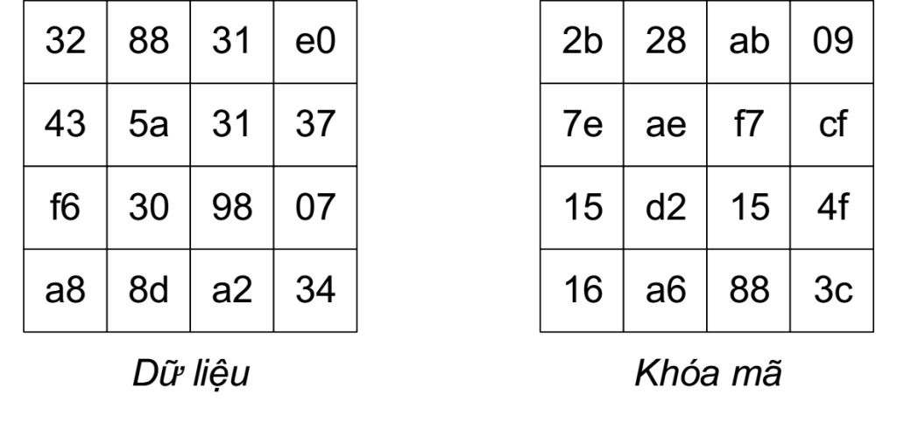

- Trong quá trình mã hóa, ma trận dữ liệu ban đầu sẽ bị biến đổi bởi các chức năng AddRoundKey, SubBytes, ShiftRows hoặc MixColumns để tạo ra các dữ liệu trung gian gọi là ma trận trạng thái.

-  Ma trận khóa mã sẽ bị biến đổi bởi chức năng KeyExpansion để tạo ra các khóa mã trung gian gọi là khóa vòng.

### 1. Mã Hóa
#### a. Sơ đồ tổng quát

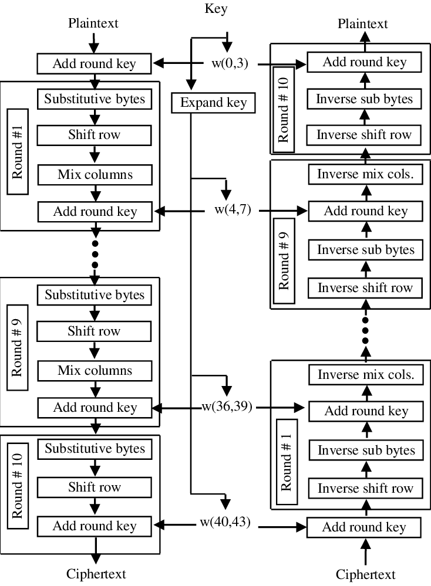

#### b. Hàm AddRoundKey:

- Ở bước khởi tạo : Từng phần tử ở ma trận dữ liệu sẽ XOR với từng phần tử ở ma trận khóa

- Ở bước lặp mã hóa và bước tạo ngõ ra: XOR ma trận trạng thái với khóa vòng

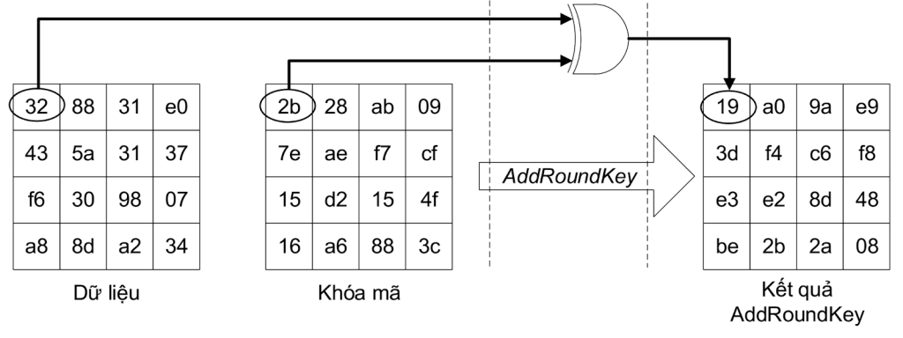

#### c. Hàm SubBytes
- Bảng S-Box được tạo ra như sau:

    + Xác định nghịch đảo cho một giá trị nhất định trên GF(28) = GF(2)[x] / (x8+x4+x3+x+1) (trường hữu hạn Rijindael).
    + Giá trị 0 không có nghịch đảo thì được ánh xạ với 0.
    + Những nghịch đảo được chuyển đổi thông qua phép biến đổi affine.

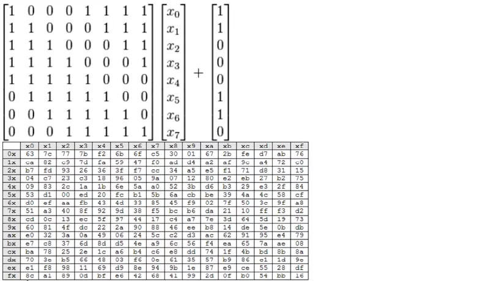

- Thay thế mỗi byte riêng của ma trận trạng thái bằng một giá trị mới bằng cách sử dụng bảng S-Box.

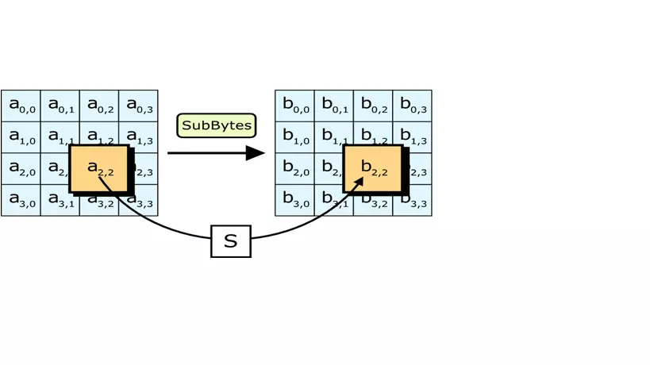

- Ví dụ, byte cần thay thế là H08 thì dò ở hàng số 0 và cột số 8 trong bảng S-box sẽ được kết quả là 30.

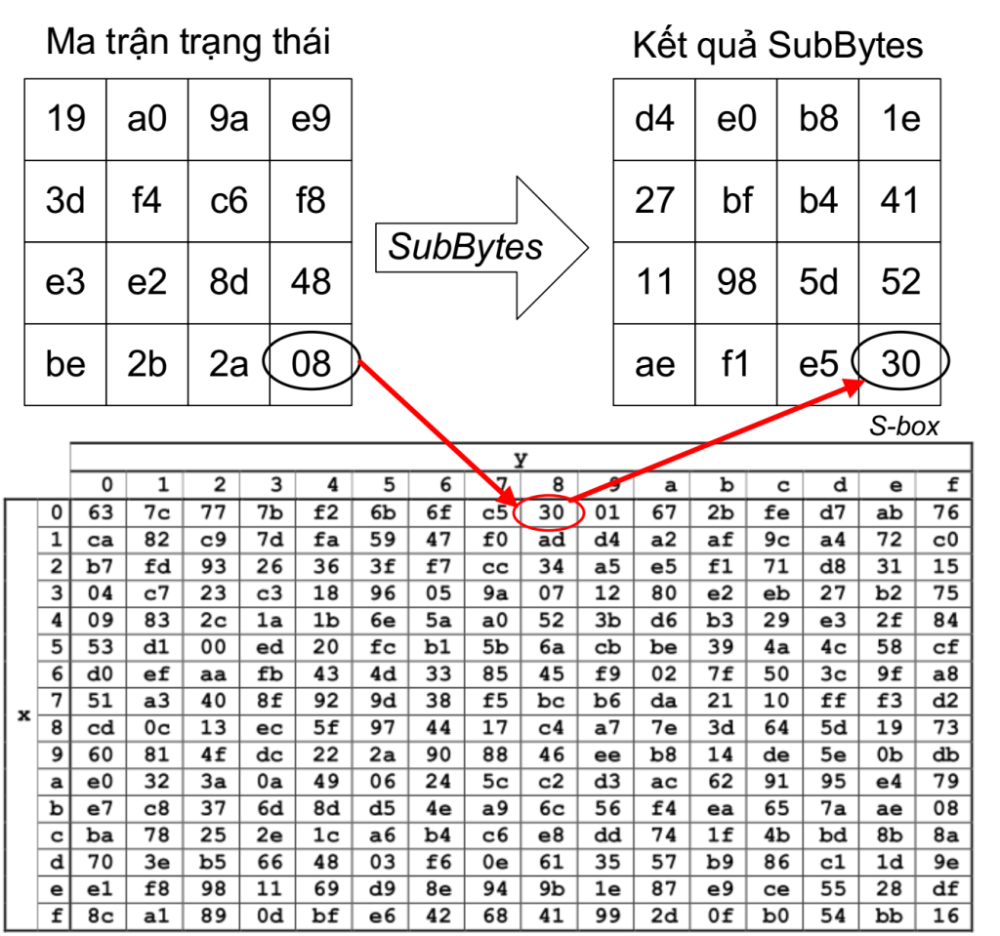

#### d. Hàm ShiftRow
- Hàm ShiftRow thực hiện hoán vị các byte trong ma trận state theo cách thức sau:

    + Dòng thứ nhất giữ nguyên.
    + Dòng thứ 2 dịch trái 1 byte.
    + Dòng thứ 3 dịch trái 2 byte.
    + Dòng thứ 3 dich trái 3 byte.

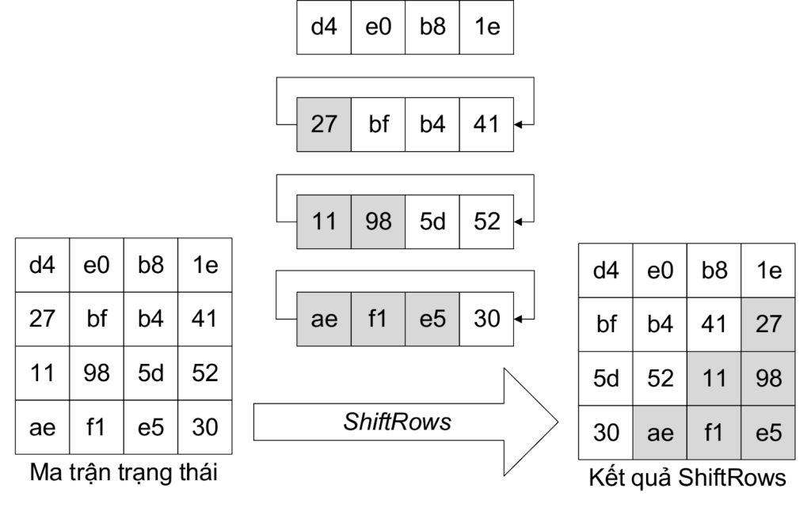

#### e. Hàm MixColumns
- Thực hiện nhân từng cột của ma trận trạng thái với 1 ma trận chuyển đổi được quy định bởi AES.

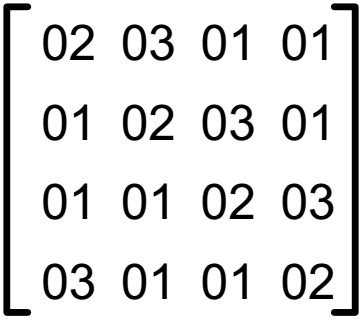

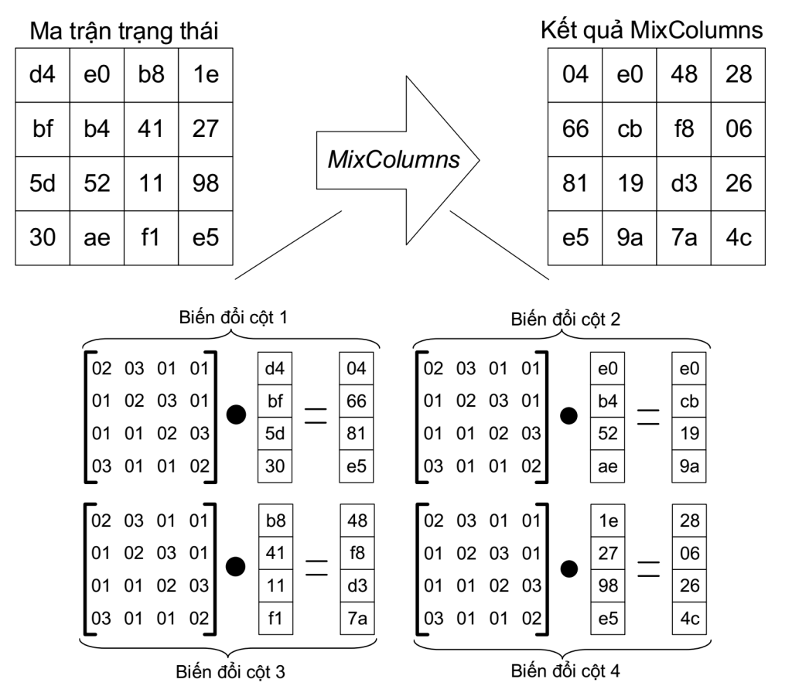

#### f. Key Expansion
- Mỗi khóa vòng 128 bit -> 4 word ( mỗi word 4 byte ) kí hiêu là w[j].
Mã hóa AES -128 có 1 khóa mã và 10 khóa vòng.
- Khóa vòng 1: w[4], w[5], w[6] và w[7] tương tự đến khóa vòng thứ 10 sẽ gồm : w[40], w[41], w[42] và w[43].
- Để tính w[j], ta thực hiện:
w[j] = AddW[j – 4] = w[j – 1] + w[j – 4]
w[j = 4∗ n] = AddW[j – 4] = trans(w[j – 1])+ w[j – 4]
- Note:  khi tính các từ ở vị trí j là bội số của 4, như w[4], w[8],… và w[40], thì w[j-1] phải được biến đổi qua 3 chức năng RotWord, SubWord và AddRcon, gọi là trans(w[j-1]), trước khi XOR với w[j-4].

- Ví dụ :

    + Lúc đầu ta có : w[0] = 2b7e1516 ; w[1] = 28aed2a6 ; w[2] = abf71588 ;  w[3] = 09cf4f3c.

    + Để tính khóa vòng 1 ( w[4], w[5], w[6], w[7] ) ta thực hiện như sau:

        + w[4] = AddW[0] = trans(w[3]) XOR w[0].

        + w[5] = AddW[1] = w[4] XOR w[1]

        + w[6] = AddW[2] = w[5] XOR w[2]

        + w[7] = AddW[3] = w[6] XOR w[3]

    + Vì w[4] <j=4> là bội của 4 nên ta thực hiên trans(w[3]):

        - Chức năng RotWord thực hiện quay trái từ w[j] một byte
        
        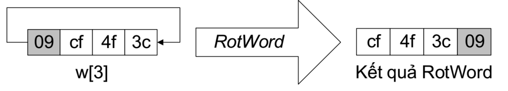

        - Chức năng SubWord thực hiện thay thế các phi tuyến từng byte của kết quả RotWord theo bảng S-box.

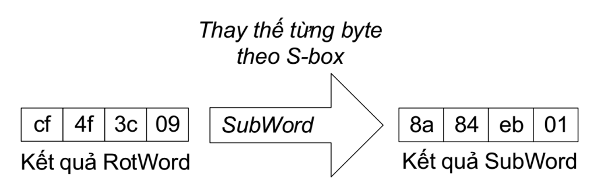

- Chức năng AddRcon thực hiện XOR kết quả SubWord và giá trị Rcon[j/4] với j là bội số của 4. Số lượng giá trị Rcon[j/4] là 10 tương ứng với 10 lần tính khóa vòng. Chức năng AddRcon sẽ tạo ra kết quả cuối cùng của biến đổi trans(w[j-1]).

- Rcon[1] = 01000000   : sử dụng cho trans(w[3]) khi tính w[4]

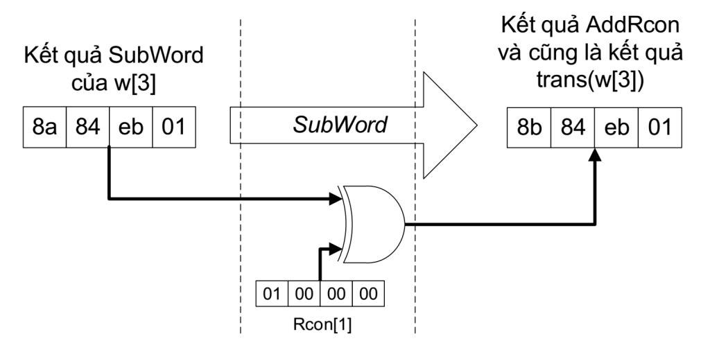

- Chức năng AddW thực hiện XOR w[j-4] với w[j-1] hoặc trans(w[j-1]) để tạo ra khóa vòng.

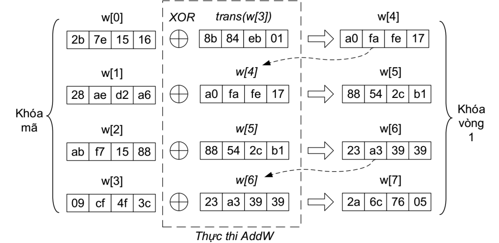

- Như vậy ta đã có các bước tính toán cần thiết để mã hóa một chuỗi dữ liệu 128 bit với key 128 bit theo giải thuật AES.