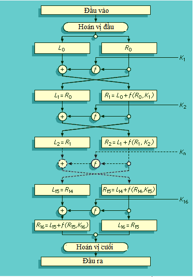
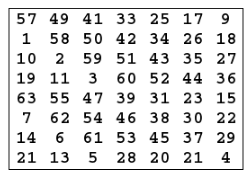
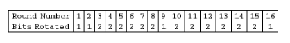
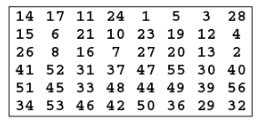
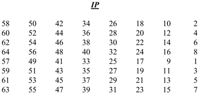
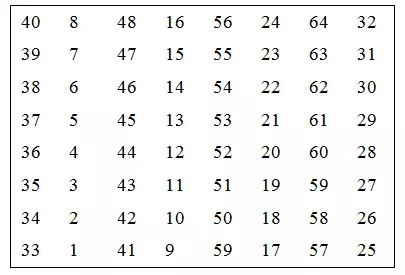
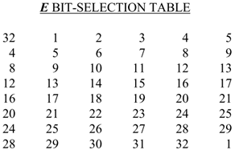
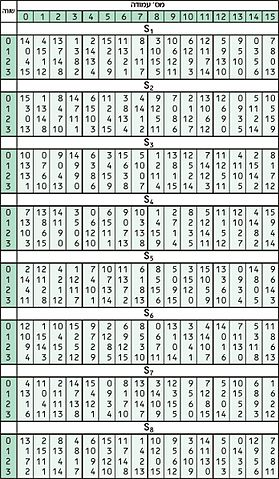
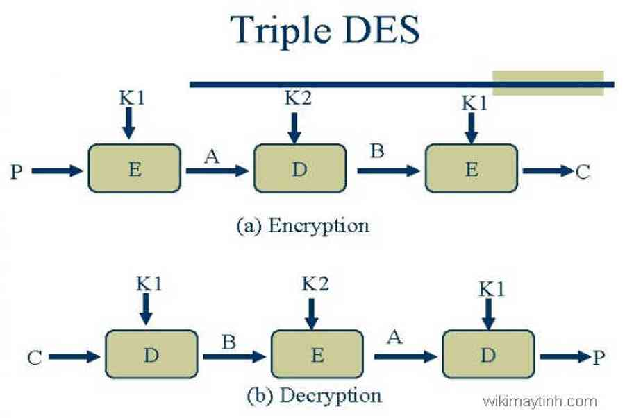

# Tiêu Chuẩn Mã Hóa DES, Triple DES
## 1. DES
### A. Giới Thiệu Về DES :
- DES (viết tắt của Data Encryption Standard, hay Tiêu chuẩn Mã hóa Dữ liệu) được NIS công nhận năm 1977, là tiêu chuẩn 46 ( FIPS PUB 46)
- Mã hóa DES bao gồm :

    + Khóa có độ dài 56 bit 
    + input: khối có độ dài 64 bit 
    + output: khối có độ dài 64 bit

- Độ an toàn của DES :

    + Sử dụng khóa 56 bit $\implies$ có xấp xỉ $2^{56}$ khóa :
        * Nếu một máy tính thực hiện mỗi giây được 1000 phép mã hóa DES thì sẽ mất hơn một nghìn năm để phá vỡ mật mã.
        * Năm 1977, Diffie và Hellman dự thảo một hệ thống có giá khoảng 20 triệu đô la Mỹ và có khả năng phá khóa DES trong 1 ngày.
        * 7/1998, khi Electronic Fronter Foundation thông báo đã phá vỡ một mã hóa DES bằng một chiếc máy tính “DES cracker” đặc biệt, được chế tạo với giá dưới 250.000$ và cuộc tấn công này diễn ra ít hơn 3 ngày.

- Những cải tiến của DES:

    + 7/1977, DES được công nhận và được tái khẳng định vào 1983, 1988, 1993 và 1999.
    + Chuẩn FIPS 46-2 nâng cấp thành Triple DES.

### B. Mô tả Thuật Toán:
- DES là thuật toán mã hóa theo khối, nó xử lý từng khối thông tin của bản rõ có độ dài xác định là 64 bit.
- Trước khi đi vào 16 chu trình chính, khối dữ liệu cần bảo mật sẽ được tách ra thành từng khối 64 bit, và từng khối 64 bit này sẽ lần lượt được đưa vào 16 vòng mã hóa DES để thực hiện.

#### a. Quá trình sinh khóa :

- Khóa ban đầu có độ dài 64 bit, bit thứ 8 của mỗi byte sẽ được lấy ra để kiểm tra phát hiện lỗi ( các bit ở vị trí 8, 16, 24, 32, 40, 48, 56, 64 là các bit parity).

- Key gốc được đánh dấu bit ( bit 1 -> bit 64) sẽ thực hiện hoán vị PC-1 (Permuted choice 1) :

- Sau khi hoán vị thì 28 bit đầu sẽ là $C_{0}$, 28 bit cuối sẽ là $D_{0}$.
- Các khóa vòng $K_{n}$ ( $n$ trong khoảng 1 -> 16 ) sẽ được tính như sau :

$$K_{n} = PC_{-2}(C_{n}D_{n})$$

- $C_{n}, D_{n}$ được tạo từ $C_{n-1} , D_{n-1}$ bằng cách dịch trái các giá trị này với số  bit được quy định như sau:

- Sau khi tính được $C_{n} , D_{n}$ thì chuỗi $C_{n}D_{n}$ sẽ được đánh số từ 1 đến 56 theo thứ tự từ trái sang phải và được hoán vị PC-2, từ đó ta thu được $K_{n}$ (48 bit) để đưa vào quá trình mã hóa :

#### b. Quá trình mã hóa:
- Giai đoạn 1: Cho bản rõ ban đầu X, hoán vị X thu được X‘ và X được hoán vị theo bảng IP ( Initial Permutation ) được mô tả như sau :

- Chuỗi đầu vào X được đánh số bit từ 1 -> 64, sau đó các bit bày được đổi vị trí như sơ đồ IP, nghĩa là bit thứ 58 sẽ trở thành bit 1, bit thứ 50 sẽ trở thành bit 2 và bit 7 sẽ trở thành bit cuối cùng.

- Giai đoạn 2: Tính $R_{i},L_{i}$ 16 lần, trong đó:

    + $L_{i} = R_{i-1}$ .
    + $R_{i} = L_{i-1} \oplus f(R_{i-1}, K_{i})$ ( $K_{i}$ là khóa được sinh ra trong quá trình tạo khóa, và ở mỗi lần lập là 1 khóa khác nhau)

- Giai đoạn 3 : Sau 16 lần mã hóa, ta thu được $R_{16}L_{16}$, áp dụng hàm hoán vị kết thúc FP ( inverse Initial Permutation ) ta thu được bản mã Y với $Y=FP(R_{16}L_{16})$

#### c. Quá trình giải mã :
- Quá trình giải mã của DES cũng tương tự quá trình mã hóa. Chỉ khác nhau ở: $L_{i} = R_{i-1}$. $R_{i} = L_{i-1} \oplus f(R_{i-1}, K_{16-i+1})$. Như vậy khóa K của hàm $f$ sẽ đi từ khóa $K_{16}$ đến khóa $K_{1}$.

#### d. Hàm $f( R_{i-1}, K_{i})$:
- $R_{i-1}$: 32 bit
- $K_{i}$: 48 bit
output: xâu 32 bit
- $R_{i-1}$ có 32 bit ( đánh dấu từ 1 -32) , giá trị này được chuyển đổi thông qua bảng E để tạo thành xâu 48 bit

- Lấy kết quả $E(R_{i-1}) \oplus K_{i}$ ta thu được xâu 48 bit, từ 48 bit này ta chia thành 8 khối mỗi khối 6 bit tương ứng với 8 hộp S-box.

- Đưa mỗi khối vào từng hộp S-box tương ứng, mỗi khối $B_{i}$ gồm 6 bit: $b_{1}b_{2}b_{3}b_{4}b_{5}b_{6}$, ta lấy $b_{1}b_{6}$ làm chỉ số hàng, $b_{2}b_{3}b_{4}b_{5}$ làm chỉ số cột .

- Ví dụ: $B_{1} = 101010$ , tìm giá trị sau khi đưa khối này qua $S_{1}$:

    + chỉ số hàng : 10 (bin) = 2 (dec)
    + chỉ số cột: 0101 (bin) = 5 (dec)

- Tra box S1, tìm vào vị trí hàng 2 cột 5 ta thu được giá trị là 6 (dec) -> 0110(bin).

- Lần lượt từ $S_{1} \to S_{6}$ tương ứng $(B_{1} \to B_{6})$ ta sẽ thu được 8 block mỗi block 4 bit $\implies$ tạo thành xâu 32 bit ( output của hàm $f(R_{i-1}, K_{i})$.

## 2. Triple DES
### A. Giới Thiệu:

- Triple DES là biến thể của DES , vì DES có thể bị bẻ gãy bằng nhứ máy móc có mục đích cụ thể để tìm ra khóa.

### B. Mô tả:
- 3DES gồm 3 khóa : $K_{1}, K_{2}, K_{3}$ với độ dài mỗi key là 64 bit , dữ liệu được mã hóa với $K_{1}$, giải mã bằng $K_{2}$ và tiếp tục mã hóa với $K_{3}$ để thu được Ciphertext.

### C. Ưu và nhược điểm của 3DES

-  Ưu điểm: Khác với DES, thuật toán mã hoá 3DES được mã hoá 3 lần DES với kích cỡ không gian khoá 168 bit cho nên an toàn hơn rất nhiều so với DES.
- Nhược điểm: Vì 3DES sử dụng 3 lần mã hoá DES cho nên tốc độ mã hoá sẽ chậm hơn rất nhiều so với DES. Phần mềm ứng dụng tỏ ra rất chậm đối với hình ảnh số và một số ứng dụng dữ liệu tốc độ cao vì kích thước khối 64 bit vẫn còn là một nhược điểm đối với những hệ có tốc độ của thế kỷ 21.

