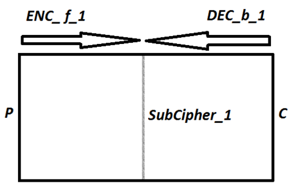

# PKCS#7 Padding và Meet-In-The-Middle Attack

## PKCS#7 Padding
### 1. Padding là gì?

- Trong mật mã khối, người ta chia văn bản thành từng khối có kích thước bằng nhau và sau đó encrypt từng khối. Nhưng nếu độ dài của Plaintext không là bội số của kích thước của khối thì chúng ta cần pad ( đệm ) vào khối cuối cùng.


- Padding là phương pháp thêm dữ liệu vào phần đầu , phần giữa hoặc phần cuối của khối dữ liệu trước khi mã hóa. Trong mật mã cổ điển, phần đệm có thể bao gồm việc thêm các cụm từ vô nghĩa vào message để che giấu đi phần kết thúc của bản rõ, vì các bản rõ này thường kết thúc theo cách dễ nhận biết.

### 2. PKCS#7 Padding

- Nguyên tắc của PKCS#7 Padding rất là đơn giản:
    - Các bytes padding sẽ luôn được thêm vào plaintext trước khi được mã hóa
    - Mỗi bytes padding sẽ có giá trị bằng tổng số bytes cần được thêm vào. Ví dụ, nếu khối plaintext cần được thêm vào 6 bytes thì mỗi bytes sẽ có giá trị là \x06.


- Dưới đây là Implement PKCS#7 padding:

```python3
def pad(msg, block_size):
    pad_len = 16 - len(msg) % block_size
    return msg + bytes([pad_len])*pad_len)
```

## Meet-In-The-Middle Attack with 2DES

### 1. Meet-In-The-Middle Attack là gì?

- Meet-In-The-Middle Attack là một kiểu tấn công Known-plaintext attack chống lại những hệ thống mã hóa phụ thuộc vào việc biểu diễn dưới dạng bội 2 hoặc nhiều hàm mã hóa (giải mã)
- Meet-In-The-Middle Attack có thể giảm đáng kể số lần brute-force key so với brute-force theo cách thông thường.



### 2. Meet-In-The-Middle Attack with 2DES

- Giả sử hacker muốn tấn công vào hệ thống 2DES với cấu trúc như sau:

    $$C = E_{K_{2}}(E_{K_{1}}(P))$$
    $$P = D_{K_{1}}(D_{K_{2}}(C))$$

- Phương trình thứ nhất có thể viết lại như sau:

     $$ E_{K_{1}}(P) =  D_{K_{2}}(C)$$
    
- Ở vế trái mình sẽ tiến hành brute-force $2^{56}  \text{  } K_{1}$, ở vế phải mình cũng sẽ tiến hành brute-force $2^{56}  \text{  } K_{2}$ cho tới khi thỏa mãn phương trình trên và chỉ có 1 cặp khóa duy nhất $(K_{1}, K_{2})$ thỏa mãn.
- Độ phức tạp của MITM Attack trong trường hợp này là $2^{56} + 2^{56} = 2^{57}$ nhanh hơn rất nhiều so với brute-force theo cách thông thường $(2^{56}2^{56} = 2^{112})$
- Với cách tấn công MITM này thì 2DES không an toàn hơn so với DES( $2^{57}$ so với $2^{56}$)


