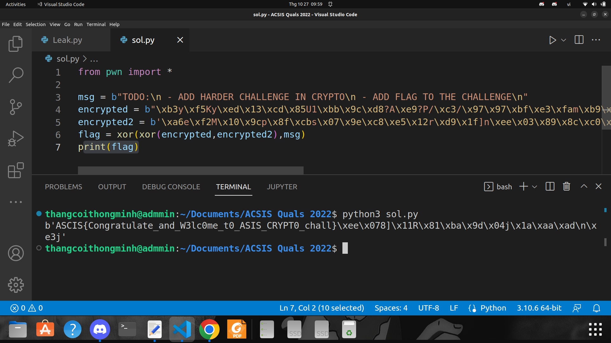

# ASCIS Quals 2022
## Cryptography

### 1. Crypto 1
- Đề bài cho 1 đoạn mã ở phần mô tả: ``;aNHI9fO_#5s\R@77&n.0geE-78liI+AkQ^1IG>)6rPj.8kh3(68g;F6o-Ja=u$``
- Mình thử ném lên tool CyberChef thì tool auto decode base85 cho mình


- Sau đó mình thử decode theo các base còn lại thì ra được flag theo decode base45:


- flag: ASCIS{th1s_1s_just_th3_b3g1nn1ng}

### 2. Crypto 2
- Đề bài cho 1 file Leak.py:

``Leak.py``

```python3
from Crypto.Cipher import AES
from Crypto.Util import Counter
from Crypto import Random

flag = open("flag.txt", "rb").read()
nonce = Random.get_random_bytes(8)
countf = Counter.new(64, nonce)
key = Random.get_random_bytes(32)

encrypto = AES.new(key, AES.MODE_CTR, counter=countf)
encrypted = encrypto.encrypt(b"TODO:\n - ADD HARDER CHALLENGE IN CRYPTO\n - ADD FLAG TO THE CHALLENGE\n")

encrypto = AES.new(key, AES.MODE_CTR, counter=countf)
encrypted2 = encrypto.encrypt(flag)

print(f"encrypted: {encrypted}")
print(f"encrypted2: {encrypted2}")

# encrypted: b"\xb3y\xf5Ky\xed\x13\xcd\x85U1\xbb\x9c\xd8?A\xe9?P/\xc3/\x97\x97\xbf\xe3\xfam\xb9\x00\xf0_\xf3\x02s\x97\x1b\x87\xeb\t\xda\xe6\x04@0\x9a\xa8\xea\x8b\xa9\x86\x87\x1c-\xeaDI\x8b\xd1v\x1e6!\xc8'\x06_\xd4\xb9"

# encrypted2: b'\xa6e\xf2M\x10\x9cp\x8f\xcbs\x07\x9e\xc8\xe5\x12r\xd9\x1f]n\xee\x03\x89\x8c\xc0\xca\xd7\x1a\x91E\xe6e\xe3\x1e`\x9d\x02\x80\xfb@\xa8\x92tUD\x81\xeb\xc4\xa6\x84\xad\xda'
```

- Dựa vào source thì đây là 1 bài AES-CTR, tác giả đã encrypt 2 plaintext khác nhau dưới cùng 1 key, ta có thể hiểu như sau:

$$C_{0} = E_{K}(Counter) \oplus P_{0} $$

$$C_{1} = E_{K}(Counter) \oplus P_{1} $$

$$\implies C_{0} \oplus C_{1} = P_{0} \oplus P_{1}$$

$$\implies P_{1} = P_{0} \oplus C_{0} \oplus C_{1}$$

- Trong đó ta đã biết $C_{0}, C_{1}, P_{0}$. $P_{1}$ là đoạn plaintext chứa flag

``sol.py``

```python3
from pwn import *

msg = b"TODO:\n - ADD HARDER CHALLENGE IN CRYPTO\n - ADD FLAG TO THE CHALLENGE\n"
encrypted = b"\xb3y\xf5Ky\xed\x13\xcd\x85U1\xbb\x9c\xd8?A\xe9?P/\xc3/\x97\x97\xbf\xe3\xfam\xb9\x00\xf0_\xf3\x02s\x97\x1b\x87\xeb\t\xda\xe6\x04@0\x9a\xa8\xea\x8b\xa9\x86\x87\x1c-\xeaDI\x8b\xd1v\x1e6!\xc8'\x06_\xd4\xb9"
encrypted2 = b'\xa6e\xf2M\x10\x9cp\x8f\xcbs\x07\x9e\xc8\xe5\x12r\xd9\x1f]n\xee\x03\x89\x8c\xc0\xca\xd7\x1a\x91E\xe6e\xe3\x1e`\x9d\x02\x80\xfb@\xa8\x92tUD\x81\xeb\xc4\xa6\x84\xad\xda'
flag = xor(xor(encrypted,encrypted2),msg)
print(flag)
```



- flag: ASCIS{Congratulate_and_W3lc0me_t0_ASIS_CRYPT0_chall}

# HackTheBoo CTF 2022
## Crypto
### 1. Gonna-lift-em-all

- Đề bài cho 2 file chall.py và data.txt:

``chall.py``

```python3
from Crypto.Util.number import bytes_to_long, getPrime
import random

FLAG = b'HTB{??????????????????????????????????????????????????????????????????????}'

def gen_params():
  p = getPrime(1024)
  g = random.randint(2, p-2)
  x = random.randint(2, p-2)
  h = pow(g, x, p)
  return (p, g, h), x

def encrypt(pubkey):
  p, g, h = pubkey
  m = bytes_to_long(FLAG)
  y = random.randint(2, p-2)
  s = pow(h, y, p)
  return (g * y % p, m * s % p)

def main():
  pubkey, privkey = gen_params()
  c1, c2 = encrypt(pubkey)

  with open('data.txt', 'w') as f:
    f.write(f'p = {pubkey[0]}\ng = {pubkey[1]}\nh = {pubkey[2]}\n(c1, c2) = ({c1}, {c2})\n')


if __name__ == "__main__":
  main()
```

``data.txt``
```
p = 163096280281091423983210248406915712517889481034858950909290409636473708049935881617682030048346215988640991054059665720267702269812372029514413149200077540372286640767440712609200928109053348791072129620291461211782445376287196340880230151621619967077864403170491990385250500736122995129377670743204192511487
g = 90013867415033815546788865683138787340981114779795027049849106735163065530238112558925433950669257882773719245540328122774485318132233380232659378189294454934415433502907419484904868579770055146403383222584313613545633012035801235443658074554570316320175379613006002500159040573384221472749392328180810282909
h = 36126929766421201592898598390796462047092189488294899467611358820068759559145016809953567417997852926385712060056759236355651329519671229503584054092862591820977252929713375230785797177168714290835111838057125364932429350418633983021165325131930984126892231131770259051468531005183584452954169653119524751729
(c1, c2) = (159888401067473505158228981260048538206997685715926404215585294103028971525122709370069002987651820789915955483297339998284909198539884370216675928669717336010990834572641551913464452325312178797916891874885912285079465823124506696494765212303264868663818171793272450116611177713890102083844049242593904824396, 119922107693874734193003422004373653093552019951764644568950336416836757753914623024010126542723403161511430245803749782677240741425557896253881748212849840746908130439957915793292025688133503007044034712413879714604088691748282035315237472061427142978538459398404960344186573668737856258157623070654311038584)
```

- Nhìn qua source thì có vẻ đây là hệ mã ElGamal nhưng đã chỉnh sửa một chút, mình chỉ cần chú ý đến line 17,18:

$$s = h^y \bmod p$$

$$ c_{1} = gy \bmod p$$

$$ c_{2} = ms \bmod p$$

$$\implies y = c_{1}g^{-1} \bmod p$$

$$\implies m = c_{2}s^{-1} \bmod p$$

``sol.py``

```python3
from Crypto.Util.number import long_to_bytes
g = 90013867415033815546788865683138787340981114779795027049849106735163065530238112558925433950669257882773719245540328122774485318132233380232659378189294454934415433502907419484904868579770055146403383222584313613545633012035801235443658074554570316320175379613006002500159040573384221472749392328180810282909
h = 36126929766421201592898598390796462047092189488294899467611358820068759559145016809953567417997852926385712060056759236355651329519671229503584054092862591820977252929713375230785797177168714290835111838057125364932429350418633983021165325131930984126892231131770259051468531005183584452954169653119524751729
p = 163096280281091423983210248406915712517889481034858950909290409636473708049935881617682030048346215988640991054059665720267702269812372029514413149200077540372286640767440712609200928109053348791072129620291461211782445376287196340880230151621619967077864403170491990385250500736122995129377670743204192511487
c1 = 159888401067473505158228981260048538206997685715926404215585294103028971525122709370069002987651820789915955483297339998284909198539884370216675928669717336010990834572641551913464452325312178797916891874885912285079465823124506696494765212303264868663818171793272450116611177713890102083844049242593904824396
c2 = 119922107693874734193003422004373653093552019951764644568950336416836757753914623024010126542723403161511430245803749782677240741425557896253881748212849840746908130439957915793292025688133503007044034712413879714604088691748282035315237472061427142978538459398404960344186573668737856258157623070654311038584
x = 159888401067473505158228981260048538206997685715926404215585294103028971525122709370069002987651820789915955483297339998284909198539884370216675928669717336010990834572641551913464452325312178797916891874885912285079465823124506696494765212303264868663818171793272450116611177713890102083844049242593904824396
y = c1*pow(g,-1,p) % p
s = pow(h,y,p)
m = c2*pow(s,-1,p) % p
print(long_to_bytes(m))
```

- flag: HTB{b3_c4r3ful_wh3n_1mpl3m3n71n6_cryp705y573m5_1n_7h3_mul71pl1c471v3_6r0up}

### 2. Spooky_rsa

- Đề bài cho 2 file chall.py và out.txt

``chall.py``

```python3
from Crypto.Util.number import bytes_to_long, getStrongPrime
from random import randint

FLAG = b'HTB{????????????????????????????????????????????}'


def key_gen(bits):
    p, q = getStrongPrime(bits), getStrongPrime(bits)
    N = p * q
    return N, (p, q)


def encrypt(m, N, f):
    e1, e2 = randint(2, N - 2), randint(2, N - 2)
    c1 = (pow(f, e1, N) + m) % N
    c2 = (pow(f, e2, N) + m) % N
    return (e1, c1), (e2, c2)


def main():
    N, priv = key_gen(1024)

    m = bytes_to_long(FLAG)

    (e1, c1), (e2, c2) = encrypt(m, N, priv[0])

    with open('out.txt', 'w') as f:
        f.write(f'N = {N}\n(e1, c1) = ({e1}, {c1})\n(e2, c2) = ({e2}, {c2})\n')


if __name__ == "__main__":
    main()
```

``out.txt``

```
N = 25458200992030509733740123651871827168179694737564741891817013763410533831135578900317404987414083347009443171337016804117994550747038777609425522146275786823385218489896468142658492353321920860029284041857237273061376882168336089921980034356731735024837853873907395117925738744950932927683784527829300499629044776530663084875991411120648155572219472426590747952180037566734905079883718263249789131313731453855593891997376222635496337534679814697188141565730768050813250191975439504290665602928172394124501396491438097237093345376202142503439944034846839870643057174427346860377971316738504003909365471892007511334129
(e1, c1) = (22255763231110249841946619835451544743470788953822278626567823902873888725104180401047359514978597528256727783972109939326623409435352523707077685530090905587264556011558283062584063790610407522064244766804545192800000203519996147931257064951519705687708204481851413899370853107413015511963924826116255617048471033727588623329910848658324118717242497443676679226618430348230146770121025920211016222285978389380202889753020268614144716241830764562717015776308425373054119742788593926393822433887270639369774139542440755201713961244129409678232953199572105700556795757766046717275157050721726002297647024020428198870290, 19074438470072195427966520314234457847008607427606084653244579403273587717215359437848959151287968653813774451872243596539852961112790372328452176435310940366312355444995843216994547119328105950997441430508803799696108202263077660206667410037895728991246260073976495701990246589717169815787627260333746927676703415397948299928151669728670970891826725671026488571268125861689964688240713660432174319415041362820791863237794347031803574182264640071528640168842529541888996148513070006266317160300336104047046565614107490019016833308549850299600989228190163831642944507973854553499903518264459385900876967183424703346566)
(e2, c2) = (23295046285127774160603234291301851851887586336491694096135804083341667982196486623010787985772884401302006627480506928365762168889259124596656609547973623161028214128429382170008181185180817200188852310143707964673736007253037970626819969310508212349854949150027746456459910448148518206090222496335254237639366458956363901115228820515207791697374943745570543635069929211464017776268424656451494147324386568859163866168248303418756480467046005765139197217754018136577337642795325944222997798231137981998354508181409469926672642302422740898720854693114056342834487668008885129303781190655860432910789997267090661459286, 17147905252678781157626731164660022679389951402035723790864177724472811805536492684462105274963820085525923148442586230016346022360533813239980197823588694113614328942373594914090007235565086360669401527248700861049825216638433673668883632064731716051799766945737234155585371938261291032941617911654796216200373195747432329591657679097825944679339369336644061159658436125778459206858632826310294115276289447751653250081978372776233383658861171699105292372718533428579168281346425439711770636421673291051002416067073005799659684303566722822458673952580001750804105442227754799536262315625088085767607467446614116889593)
```

- Nhìn vào source thì đây là một bài RSA, mình cần để ý ở line 15, 16.
- Mình có thể khôi phục lại $p$ bằng cách lấy $gcd(c_{1} - c_{2}, N)$ vì:

$$c_{1} = [(p^{e_{1}} \bmod N) + m] \bmod N $$

$$c_{2} = [(p^{e_{2}} \bmod N) + m] \bmod N$$

$$\implies c_{1} - c_{2} \equiv p^{e_{1}} - p^{e_{2}} \pmod N$$

$$\iff c_{1} - c_{2} \equiv p(p^{e_{1}-1} - p^{e_{2}-1}) \pmod N$$

$$\implies gcd(p(p^{e_{1}-1} - p^{e_{2}-1}),N) = gcd(c_{1} - c_{2}, N) = p$$

- Có được $p$ rồi mình sẽ khôi phục lại m một cách dễ dàng:

``sol.py``

```python3
from math import gcd
from Crypto.Util.number import long_to_bytes, GCD
N = 25458200992030509733740123651871827168179694737564741891817013763410533831135578900317404987414083347009443171337016804117994550747038777609425522146275786823385218489896468142658492353321920860029284041857237273061376882168336089921980034356731735024837853873907395117925738744950932927683784527829300499629044776530663084875991411120648155572219472426590747952180037566734905079883718263249789131313731453855593891997376222635496337534679814697188141565730768050813250191975439504290665602928172394124501396491438097237093345376202142503439944034846839870643057174427346860377971316738504003909365471892007511334129
(e1, c1) = (22255763231110249841946619835451544743470788953822278626567823902873888725104180401047359514978597528256727783972109939326623409435352523707077685530090905587264556011558283062584063790610407522064244766804545192800000203519996147931257064951519705687708204481851413899370853107413015511963924826116255617048471033727588623329910848658324118717242497443676679226618430348230146770121025920211016222285978389380202889753020268614144716241830764562717015776308425373054119742788593926393822433887270639369774139542440755201713961244129409678232953199572105700556795757766046717275157050721726002297647024020428198870290, 19074438470072195427966520314234457847008607427606084653244579403273587717215359437848959151287968653813774451872243596539852961112790372328452176435310940366312355444995843216994547119328105950997441430508803799696108202263077660206667410037895728991246260073976495701990246589717169815787627260333746927676703415397948299928151669728670970891826725671026488571268125861689964688240713660432174319415041362820791863237794347031803574182264640071528640168842529541888996148513070006266317160300336104047046565614107490019016833308549850299600989228190163831642944507973854553499903518264459385900876967183424703346566)
(e2, c2) = (23295046285127774160603234291301851851887586336491694096135804083341667982196486623010787985772884401302006627480506928365762168889259124596656609547973623161028214128429382170008181185180817200188852310143707964673736007253037970626819969310508212349854949150027746456459910448148518206090222496335254237639366458956363901115228820515207791697374943745570543635069929211464017776268424656451494147324386568859163866168248303418756480467046005765139197217754018136577337642795325944222997798231137981998354508181409469926672642302422740898720854693114056342834487668008885129303781190655860432910789997267090661459286, 17147905252678781157626731164660022679389951402035723790864177724472811805536492684462105274963820085525923148442586230016346022360533813239980197823588694113614328942373594914090007235565086360669401527248700861049825216638433673668883632064731716051799766945737234155585371938261291032941617911654796216200373195747432329591657679097825944679339369336644061159658436125778459206858632826310294115276289447751653250081978372776233383658861171699105292372718533428579168281346425439711770636421673291051002416067073005799659684303566722822458673952580001750804105442227754799536262315625088085767607467446614116889593)
p = gcd(c1-c2,N)
a = pow(p,e1,N)
m = (c1-a) % N
print(long_to_bytes(m))
```

- flag: HTB{5h45_w4$_sUpp0s3d_50_b3_m0r3_s3cUr3_th4n_R$4}


