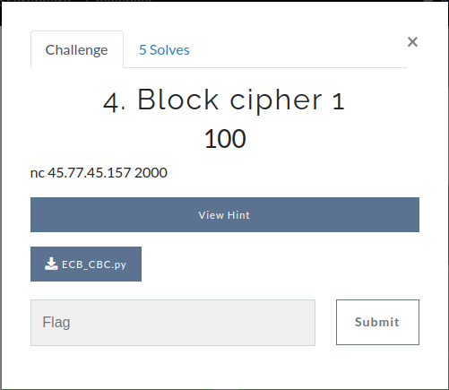
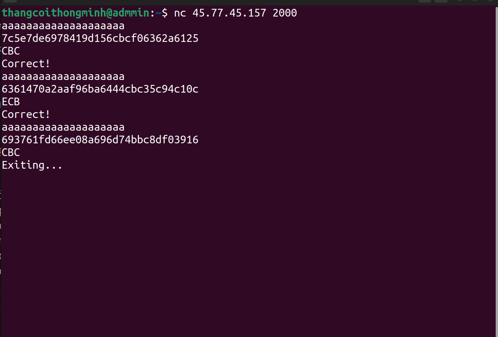
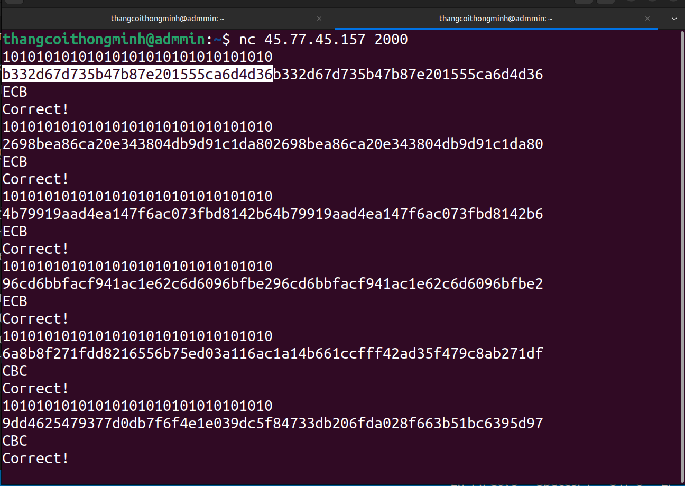
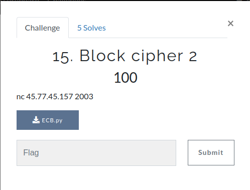
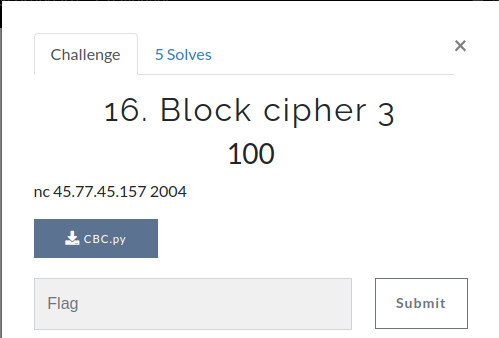
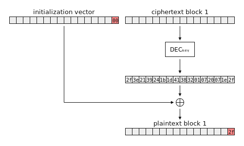
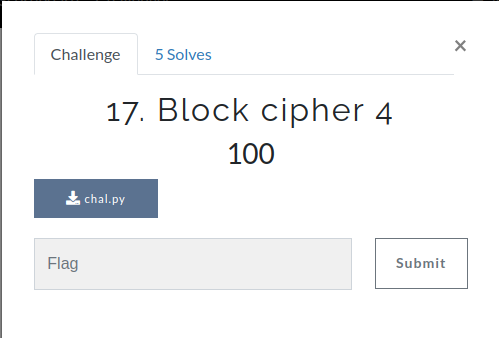
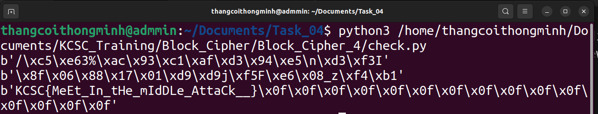

# Write-ups Block Cipher 1-4 trên KCSC Training

## Block Cipher 1
- Đề bài cho 1 file chall ECB_CBC.py



``ECB_CBC.py``

```
from Crypto.Cipher import AES
from Crypto.Util.Padding import pad
from random import choice
from os import urandom

FLAG = b'KCSC{?????????????????????}'

if __name__ == '__main__':
    for i in range(100):
        x = choice(['ECB','CBC'])
        if x == 'ECB':
            cipher = AES.new(urandom(16), AES.MODE_ECB)
        else:
            cipher = AES.new(urandom(16), AES.MODE_CBC, urandom(16))

        try:
            msg = bytes.fromhex(input())
            assert len(msg) <= 16
            print(cipher.encrypt(pad(msg,16)).hex())
            ans = input()
            assert ans == x
            print('Correct!')
        except:
            print("Exiting...")
            quit()

    print(FLAG)
```



- Dựa vào source thì có thể thấy server cho mình nhập vào 1 chuỗi hexa không quá 12 bytes và sau đó encrypt theo 1 trong 2 mode ECB hoặc CBC, công việc của mình là sẽ đoán xem đoạn mã được encrypt theo mode nào, nếu đoán đúng, server sẽ in ra dòng Correct!, nếu sai server sẽ thoát ra ngoài, nếu đoán đúng 100 lần liên tiếp thì server sẽ in ra flag.

- Mình cần chú ý đến hàm pad() trong source, đoạn plain text mình nhập vào trước khi được mã hóa thì sẽ được padding theo tiêu chuẩn PKCS#7 
- Mình cũng sẽ lợi dụng điểm yếu của mode ECB đó là các block plaintext giống nhau sẽ cho ra các block ciphertext giống nhau
- Mình sẽ cần ít nhất là 2 khối plaintext và mình cần phải nhập làm sao mà sau khi padding 2 khối đó sẽ giống nhau hoàn toàn
- Nếu sau khi encrypt server trả về 2 khối ciphertext giống nhau thì đó chắc chắn là mode ECB, nếu khác nhau thì đó là mode CBC
- Mình sẽ nhập thử 32 kí tự hexa 1010...



- Lí do là vì sau khi nhập như vậy xong server sẽ encode thành 16 bytes 0x10 và pad thêm 16 bytes 0x10 nữa theo tiêu chuẩn PKCS#7, như vậy là ta đã có 2 block plaintext giống nhau
- Và giờ mình sẽ bắt tay vào công việc viết sourcesource

``sol.py``

```python3
from pwn import *
io = remote('45.77.45.157', 2000)
for i in range(100):
    io.sendline(b'10'*16)
    c = io.recvline()[:-1].decode()
    c1 = c[:len(c)//2]
    c2 = c[len(c)//2:]
    if c1 == c2:
        io.sendline('ECB'.encode())
    else:
        io.sendline('CBC'.encode())
    io.recvline()

io.interactive()
# KCSC{Bingo!_PKCS#7_padding}
```
flag: KCSC{Bingo!_PKCS#7_padding}


## Block Cipher 2



- Đề bài cho 1 file chall ECB.py

``ECB.py``

```python3
from Crypto.Cipher import AES
from os import urandom
from base64 import b64encode
import string


chars = string.ascii_lowercase + string.ascii_uppercase + '!_{}'
FLAG = b'KCSC{___}'
assert all(i in chars for i in FLAG.decode())


def pad(msg, block_size):
    if len(msg) % block_size == 0:
        return msg
    return msg + bytes(block_size - len(msg) % block_size)


def chall(usrname):
    key = urandom(16)
    cipher = AES.new(key, AES.MODE_ECB)
    msg = b'Hello ' + usrname + b', here is your flag: ' + FLAG + b'. Have a good day, we hope to see you soon.'
    enc = cipher.encrypt(pad(msg,16))
    return b64encode(enc)

    
if __name__ == '__main__':
    while True:
        usrname = input()
        print( chall(usrname.encode()) )
```

- Server cho mình nhập vào chuỗi kí tự tùy thích và sau đó trả về 1 đoạn ciphertext được encrypt theo mode AES-ECB(pad(Hello || user_input ||, here is your flag: || FLAG ||  Have a good day, we hope to see you soon.))
- Giống như bài trên mình cũng sẽ lợi dụng điểm yếu của mode ECB là các block plaintext giống nhau sẽ cho ra các block ciphertext giống nhau. Như vậy có thể tìm lại từng chữ của flag bằng cách so sánh hai khối, trong đó ? là một byte dùng để brute force những chữ có thể của flag.

```
Hello 0000000000 
 is your flag: ?  <- username = 0000000000 is your flag: ?0000000000000000000000000000000000000000000000000000000000
0000000000000000
0000000000000000
0000000000000000
0000000000, here
 is your flag: K
CSC{XXXXXXXXXXXX
XXXXXXXXXXXXXXX}
...

Hello 0000000000 
is your flag: K?  <- username = 0000000000is your flag: K?000000000000000000000000000000000000000000000000000000000
0000000000000000
0000000000000000
0000000000000000
000000000, here
is your flag: KC
SC{XXXXXXXXXXXXX
XXXXXXXXXXXXXX}
...

Hello 0000000000 
s your flag: KC?  <- username = 0000000000s your flag: KC?00000000000000000000000000000000000000000000000000000000
0000000000000000
0000000000000000
0000000000000000
00000000, here i
s your flag: KCS
C{XXXXXXXXXXXXXX
XXXXXXXXXXXXX}
...
```

``sol.py``
```python3
from pwn import *
from base64 import b64decode
from string import printable
host = '45.77.45.157'
port = 2003
io = remote(host, port)
flag = ''
payload1 = '  is your flag: '
brt_char = ''
for i in range(58):
    payload1 = payload1[1:] + brt_char
    for j in printable:
        payload = 'Wow!, here' + payload1 + j + '0'*(16*3 + 10 - i)
        io.sendline(payload.encode())
        a = io.recvuntil(b'\n')[:-1].decode()
        b = b64decode(a)
        if b[16:32] == b[96:112]:
            flag += j
            brt_char = j
            print(flag)

io.interactive()
#KCSC{Chosen_Plaintext_Attack___ECB_ECB_ECB___you_made_it!}
```

flag: KCSC{Chosen_Plaintext_Attack___ECB_ECB_ECB___you_made_it!}

## Block Cipher 3


``CBC.py``
```python3
from Crypto.Cipher import AES
from os import urandom
import string


chars = string.ascii_lowercase + string.ascii_uppercase + string.digits + '!_{}'
FLAG = b'KCSC{___}'
assert all(i in chars for i in FLAG.decode())


def pad(msg, block_size):
    pad_len = 16 - len(msg) % block_size
    return msg + bytes([pad_len])*pad_len


def encrypt(key):
    iv = urandom(16)
    cipher = AES.new(key, AES.MODE_CBC, iv)
    return (iv + cipher.encrypt(pad(FLAG,16)) ).hex()
    
    
def decrypt(enc,key):
    enc = bytes.fromhex(enc)
    iv = enc[:16]
    ciphertext = enc[16:]
    cipher = AES.new(key, AES.MODE_CBC, iv)
    decrypted = cipher.decrypt(ciphertext)
    pad_len = decrypted[-1]
    if all(i == pad_len for i in decrypted[-pad_len:]):
        return b'Decrypted successfully.'
    else:
        return b'Incorrect padding.'


if __name__ == '__main__':
    key = urandom(16)
    while True:
        choice = input()
        if choice == 'encrypt':
            print(encrypt(key))
        elif choice == 'decrypt':
            c = input('Ciphertext: ')
            try:
                print(decrypt(c,key))
            except:
                continue
```
- Server cho mình nhập 2 lựa chọn: 'encrypt' hoặc 'decrypt'
- Nếu chọn 'encrypt', server sẽ trả về đoạn ciphertext AES-CBC(pad(iv || flag))
- Nếu chọn 'decrypt', server sẽ cho mình nhập đoạn ciphertext, decrypt đoạn ciphertext đó và kiểm tra xem đoạn plaintext đã được pad đúng chưa, nếu đúng sẽ trả về 'Decrypted successfully', nếu sai sẽ trả về 'Incorrect padding.'
- Đây là kiểu tấn công Padding Oracle Attack:
	- Đặt:
		- $k$: là độ dài (số lượng byte) từng khối bản mã $C_{i}$ cũng như bản rõ Pi.
		- $C_{n}$: là khối bản mã cần giải mã; giả sử giải mã từ cuối lên.
		- $C'$: là khối byte mà ta tạo ra để đóng vai trò giống như khối $C_{n-1}$ trong việc giải mã $C_{n}$; nhưng nó không phải $C_{n-1}$, mà ta có thể thoải mái điều chỉnh giá trị từng byte của khối $C'$ này.
		- $P'_{n}$: là bản rõ mà Server thu được sau khi giải mã $C_{n}$ với khối $C'$ mà ta cung cấp. Lưu ý rằng $P'_{}n$ này không phải bản rõ chính xác $P_{n}$ của khối $C_{n}$.
	- Biến đổi:
		- Giải mã $C_{n}$, ta được:
		- $D(C_{n}) \oplus C'=P'_{n}$ 
	- Mà theo công thức tổng quát của việc mã hóa:
		- $E(C_{n−1} \oplus P_{n}) =C_{n}$
	- Ốp vào, ta thu được:
		- $D(E(C_{n−1}⊕P_{n}))\oplus C' = P'_{n} ⇔ P'_{n} = C_{n−1}\oplus P_{n} \oplus C'$ (1*) 
	- Trong công thức (1*), ta thấy rằng:
		- $P'_{n}$: là giá trị bản rõ ta không biết, là giải mã của Server sau khi ta gửi ${C' || C_{n}}$ lên.
		- $P_{n}$: là bản rõ ta không biết, và cần phải mò ra.
		- $C_{n-1}$: là khối bản mã thật, ngay trước $C_{n}$; ta biết giá trị này!
		- $C'$: là khối bản mã giả, đóng vai trò như khối $C_{n-1}$;  ta có full quyền chỉnh sửa với khối này.
	- Như bạn đã thấy, với một phương trình nghiệm nguyên có 2 ẩn chưa biết, cách đơn giản nhất là thực hiện “thử chọn” với 1 ẩn để tìm ra ẩn còn lại. Do đó cách thức sẽ là thử chọn với một biến bản rõ để mò ra khối bản rõ còn lại.

	- Vì cần xác định byte cuối cùng của PN trước; mà công thức (1*) lại là công thức đại số boolean, nên nó cũng đúng với từng byte độc lập trong mỗi khối của các bản ghi. Nên nếu áp dụng công thức (1*) cho byte cuối cùng trong từng bản ghi, ta sẽ thu được cái này:

		- $P'_{n}[k] = C_{n−1}[k] \oplus P_{n}[k] \oplus C'[k]$  (2∗) 
	- Khi Server nhận được ${C' || C_{n}}$, Server sẽ giải mã để lấy ra $P'_{n}$. Server sẽ kiểm tra phần Padding của $P'_{n}$ (chứ không cần biết $P'_{n}$ có đúng bằng $P_{n}$ không; vì thực chất Server cũng đâu có biết $P_{n}$). Nếu Padding hợp lệ, Server sẽ hồi đáp bằng thông điệp 'Decrypted successfully'; ngược lại, Server sẽ hồi đáp bằng thông điệp 'Incorrect padding.'

	- Do đó, ta hoàn toàn có thể giả sử Padding của $P_{n}$ có giá trị bằng 0x01; nghĩa là chỉ cần lấp đầy byte cuối cùng. Sau khi thử chọn phát lại (tối đa 256 lần) đối với sự thay đổi của $C'[k]$ trong $C'$, ta sẽ tìm được giá trị chính xác byte cuối của $D(C_{n})$; từ đó đem XOR với $C_{n-1}$, ta có thể tìm ra được chính xác byte cuối của $P_{n}$ !

    - 

    - Trong (2*) ta thấy:
		- $P'_{n}[k]$: là byte ta giả định nó phải bằng 0x01 để thực hiện tấn công phát lại đến khi nhận được tín hiệu 'Decrypted successfully'
		- $P_{n}[k]$: vẫn là byte cuối cùng mà ta chưa biết. Lưu ý là chưa biết nhé; vì sắp biết rồi! 😁
		- $C_{n-1}[k]$ là byte cuối cùng của bản mã $C_{n-1}$, đương nhiên ta đã biết giá trị này.
		- $C'[k]$: là byte chúng ta có full quyền điều khiển. Ta sẽ điều khiển giá trị của byte này (tối đa 256 lần) cho đến khi nào nhận được 'Decrypted successfully'
	- Từ đó, biến đổi lại (2*), ta được:
		- (2∗) $⇔P_{n}[k]=P'_{n}[k]\oplus C_{n−1}[k]⊕C'[k] $
		- $⇔P_{n}[k]=1⊕C_{n−1}[k]⊕C'[k]$ (3∗) 
	- Với các byte tiếp theo, ta thực hiện tương tự quy trình tấn công phát lại, chỉ cần lưu ý:
	- Theo tiêu chuẩn PKCS#7, ta phải thay đổi sao cho hướng đến mục địch Padding của $P'_{n}$ phải đúng định dạng; ví dụ như 0x02|0x02 hoặc 0x03|0x03|0x03, ...
	- Sau khi đã giải mã được các byte trước, ta phải cố định những byte cuối cùng tương ứng của $C'$ sao cho thỏa mãn Padding của $P'_{n}$.
    - 

``sol.py``
```python3
from pwn import *
host = 'localhost'
port = 2004
io = remote(host,port)
io.sendline(b'encrypt')
output = io.recvuntil(b'\n')
o = output[:-1].decode()
output = bytes.fromhex(o)
print(output)
iv = output[:16]
c = output[16:]
result = b''
for k in range(2):
    last_block = c[16*k:16*k+16]
    controlled_plaintext = b''
    block_after_decrypt = [0]*16
    controlled_cipher = bytes([0]*16)
    ct = b''
    for j in range(1,17,1):
        for i in range(256):
            controlled_cipher = controlled_cipher[:-j] + bytes([i]) + controlled_plaintext
            ct = iv + controlled_cipher + last_block
            print(ct)
            io.sendline(b'decrypt')
            io.recvuntil(b'Ciphertext: ')
            io.sendline(ct.hex().encode())
            a = io.recvuntil(b'\n')
            print(a)
            if a[:-1] == b'Decrypted successfully.':
                block_after_decrypt[-j] = i ^ j
                controlled_plaintext = b''
                controlled_plaintext = xor(bytes([j+1])*j , bytes(block_after_decrypt[-j:]))
                break
    result += xor(bytes(block_after_decrypt),output[16*k:16*k+16])

print(result)
io.interactive()

# KCSC{CBC_p4dd1ng_0racle_}
```
flag: KCSC{CBC_p4dd1ng_0racle_}
## Block Cipher 4

- Đề bài cho 1 file chal.py
``chal.py``
```python3
from Crypto.Cipher import AES
from Crypto.Util.Padding import pad
from hashlib import md5
from os import urandom

FLAG = b"KCSC{???????????????????????????}"
assert len(FLAG) % 16 == 1 # hint

key1 = md5(urandom(3)).digest()
key2 = md5(urandom(3)).digest()
cipher1 = AES.new(key1, AES.MODE_ECB)
cipher2 = AES.new(key2,AES.MODE_ECB)

enc = cipher1.encrypt(pad(FLAG,16))
enc = cipher2.encrypt(enc)

print(enc.hex())

# 21477fac54cb5a246cb1434a1e39d7b34b91e5c135cd555d678f5c01b2357adc0c6205c3a4e3a8e6fb37c927de0eec95
```

- Dựa vào source thì mình biết được rằng flag đã được encrypt 2 lần AES-ECB với 2 key1, key2 sau khi hash md5 3 bytes bất kỳ
- Đây là kiểu tấn công Meet-In-The-Middle và không gian khóa không quá lớn có thể brute-force được ($256^3 = 16777216$)
- Nói qua về Meet In The Middle Attack:
    + Message được mã hoá 2 lần qua AES-ECB với 2 key khác nhau
    + Để có thể khôi phục lại message thì mình sẽ cần phải biết một đoạn plaintext và ciphertext tương ứng
    + Bước đầu tiên thì mình sẽ tạo một list chứa các key và ciphertext tương ứng với key này mà đoạn plaintext của mình đã biết được encrypt… list này là một list chứa tất cả các trường hợp có thể xảy ra mà message được mã hoá lần đầu tiên
    + Tiếp theo là mình decrypt ciphertext mà mình đã biết với tất cả các key có thể xảy ra rồi thử tìm xem nó có trong list ở phía trên không, nếu có thì ta đã có được key1 và key2 (key1 là key để encrypt đoạn plaintext đã biết và key2 là key đề decrypt đoạn ciphertext đã biết)

- Mình có để ý trong source code thì lần encrypt đầu tiên thì flag đã được pad thêm một đoạn… mà flag bị dư 1 byte sau khi mod 16 tức là plaintext sẽ được pad thêm 15 bytes 0x0f và mình cũng có thể đoán được byte cuối cùng của flag là '}'

``sol.py``

```python3
from Crypto.Cipher import AES
from Crypto.Util.Padding import pad
from hashlib import md5
ct = bytes.fromhex('21477fac54cb5a246cb1434a1e39d7b34b91e5c135cd555d678f5c01b2357adc0c6205c3a4e3a8e6fb37c927de0eec95')
table = {}
know = b'}' + b'\x0f'*15
for a in range(256):
    for b in range(256):
        for c in range(256):
            iv = bytes([a]) + bytes([b]) + bytes([c])
            key = md5(iv).digest()
            cipher = AES.new(key, AES.MODE_ECB)
            d = cipher.encrypt(know)
            json = {d : key}
            table.update(json)

key1 = b''
key2 = b''

for a in range(256):
    for b in range(256):
        for c in range(256):
            iv = bytes([a]) + bytes([b]) + bytes([c])
            key = md5(iv).digest()
            cipher = AES.new(key, AES.MODE_ECB)
            pt = cipher.decrypt(ct[-16:])
            if pt in table.keys():
                key1 = table[pt]
                key2 = key
                print(key1)
                print(key2)
                break

ct = bytes.fromhex('21477fac54cb5a246cb1434a1e39d7b34b91e5c135cd555d678f5c01b2357adc0c6205c3a4e3a8e6fb37c927de0eec95')
cipher1 = AES.new(key1, AES.MODE_ECB)
cipher2 = AES.new(key2, AES.MODE_ECB)

dec = cipher2.decrypt(ct)
dec = cipher1.decrypt(dec)

print(dec)

# KCSC{MeEt_In_tHe_mIdDLe_AttaCk__}
```

flag: KCSC{MeEt_In_tHe_mIdDLe_AttaCk__}
