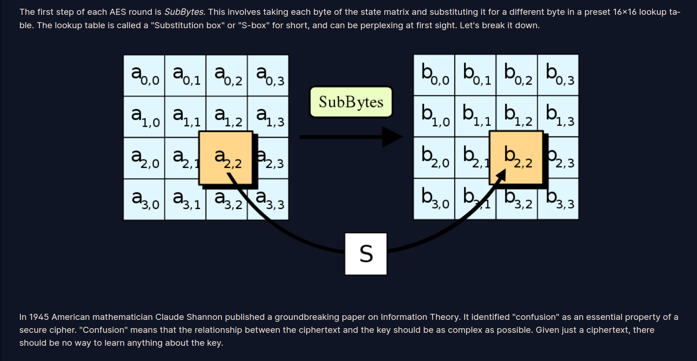

# Write-ups HOW AES WORKS + SYMMETRIC STARTER + BLOCK CIPHERS
## HOW AES WORKS

### 1. Keyed Permutations


- flag: crypto{bijection}
### 2. Resisting Bruteforce


- flag: crypto{biclique}
### 3. Structure of AES


- Đề bài cho 1 file matrix.py

``matrix.py``

```python3
def bytes2matrix(text):
    """ Converts a 16-byte array into a 4x4 matrix.  """
    return [list(text[i:i+4]) for i in range(0, len(text), 4)]

def matrix2bytes(matrix):
    """ Converts a 4x4 matrix into a 16-byte array.  """
    ????

matrix = [
    [99, 114, 121, 112],
    [116, 111, 123, 105],
    [110, 109, 97, 116],
    [114, 105, 120, 125],
]

print(matrix2bytes(matrix))
```
- Công việc của mình rất đơn giản là chuyển thành ma trận byte trở lại chuỗi byte như bình thường

``sol.py``
```python3
def bytes2matrix(text):
    """ Converts a 16-byte array into a 4x4 matrix.  """
    return [list(text[i:i+4]) for i in range(0, len(text), 4)]

def matrix2bytes(matrix):
    """ Converts a 4x4 matrix into a 16-byte array.  """
    plain = b''
    for i in matrix:
        for j in i:
            plain += bytes([j])
    return plain

matrix = [
    [99, 114, 121, 112],
    [116, 111, 123, 105],
    [110, 109, 97, 116],
    [114, 105, 120, 125],
]

print(matrix2bytes(matrix))
# crypto{inmatrix}
```
- flag: crypto{inmatrix}

### 4. Round Keys


- Đề bài cho 1 file add_round_key.py

``add_round_key.py``

```python3
state = [
    [206, 243, 61, 34],
    [171, 11, 93, 31],
    [16, 200, 91, 108],
    [150, 3, 194, 51],
]

round_key = [
    [173, 129, 68, 82],
    [223, 100, 38, 109],
    [32, 189, 53, 8],
    [253, 48, 187, 78],
]


#def add_round_key(s, k):
    ???


#print(add_round_key(state, round_key))
```

- Ở chall này thực hiện chức năng add round key, tức là từng bytes của ma trận trạng thái sẽ xor với từng byte tương ứng của ma trận key, giờ ta chỉ cần làm ngược lại:

``sol.py``
```python3
state = [
    [206, 243, 61, 34],
    [171, 11, 93, 31],
    [16, 200, 91, 108],
    [150, 3, 194, 51],
]

round_key = [
    [173, 129, 68, 82],
    [223, 100, 38, 109],
    [32, 189, 53, 8],
    [253, 48, 187, 78],
]


def add_round_key(s, k):
    plain = b''
    for a,b in zip(s,k):
        for i,j in zip(a,b):
            plain += bytes([i^j])
    return plain

print(add_round_key(state, round_key))

# crypto{r0undk3y}
```

flag: crypto{r0undk3y}

### 5. Confusion through Substitution



- Đề bài cho 1 file sbox.py

``sbox.py``

```python3
s_box = (
    0x63, 0x7C, 0x77, 0x7B, 0xF2, 0x6B, 0x6F, 0xC5, 0x30, 0x01, 0x67, 0x2B, 0xFE, 0xD7, 0xAB, 0x76,
    0xCA, 0x82, 0xC9, 0x7D, 0xFA, 0x59, 0x47, 0xF0, 0xAD, 0xD4, 0xA2, 0xAF, 0x9C, 0xA4, 0x72, 0xC0,
    0xB7, 0xFD, 0x93, 0x26, 0x36, 0x3F, 0xF7, 0xCC, 0x34, 0xA5, 0xE5, 0xF1, 0x71, 0xD8, 0x31, 0x15,
    0x04, 0xC7, 0x23, 0xC3, 0x18, 0x96, 0x05, 0x9A, 0x07, 0x12, 0x80, 0xE2, 0xEB, 0x27, 0xB2, 0x75,
    0x09, 0x83, 0x2C, 0x1A, 0x1B, 0x6E, 0x5A, 0xA0, 0x52, 0x3B, 0xD6, 0xB3, 0x29, 0xE3, 0x2F, 0x84,
    0x53, 0xD1, 0x00, 0xED, 0x20, 0xFC, 0xB1, 0x5B, 0x6A, 0xCB, 0xBE, 0x39, 0x4A, 0x4C, 0x58, 0xCF,
    0xD0, 0xEF, 0xAA, 0xFB, 0x43, 0x4D, 0x33, 0x85, 0x45, 0xF9, 0x02, 0x7F, 0x50, 0x3C, 0x9F, 0xA8,
    0x51, 0xA3, 0x40, 0x8F, 0x92, 0x9D, 0x38, 0xF5, 0xBC, 0xB6, 0xDA, 0x21, 0x10, 0xFF, 0xF3, 0xD2,
    0xCD, 0x0C, 0x13, 0xEC, 0x5F, 0x97, 0x44, 0x17, 0xC4, 0xA7, 0x7E, 0x3D, 0x64, 0x5D, 0x19, 0x73,
    0x60, 0x81, 0x4F, 0xDC, 0x22, 0x2A, 0x90, 0x88, 0x46, 0xEE, 0xB8, 0x14, 0xDE, 0x5E, 0x0B, 0xDB,
    0xE0, 0x32, 0x3A, 0x0A, 0x49, 0x06, 0x24, 0x5C, 0xC2, 0xD3, 0xAC, 0x62, 0x91, 0x95, 0xE4, 0x79,
    0xE7, 0xC8, 0x37, 0x6D, 0x8D, 0xD5, 0x4E, 0xA9, 0x6C, 0x56, 0xF4, 0xEA, 0x65, 0x7A, 0xAE, 0x08,
    0xBA, 0x78, 0x25, 0x2E, 0x1C, 0xA6, 0xB4, 0xC6, 0xE8, 0xDD, 0x74, 0x1F, 0x4B, 0xBD, 0x8B, 0x8A,
    0x70, 0x3E, 0xB5, 0x66, 0x48, 0x03, 0xF6, 0x0E, 0x61, 0x35, 0x57, 0xB9, 0x86, 0xC1, 0x1D, 0x9E,
    0xE1, 0xF8, 0x98, 0x11, 0x69, 0xD9, 0x8E, 0x94, 0x9B, 0x1E, 0x87, 0xE9, 0xCE, 0x55, 0x28, 0xDF,
    0x8C, 0xA1, 0x89, 0x0D, 0xBF, 0xE6, 0x42, 0x68, 0x41, 0x99, 0x2D, 0x0F, 0xB0, 0x54, 0xBB, 0x16,
)

inv_s_box = (
    0x52, 0x09, 0x6A, 0xD5, 0x30, 0x36, 0xA5, 0x38, 0xBF, 0x40, 0xA3, 0x9E, 0x81, 0xF3, 0xD7, 0xFB,
    0x7C, 0xE3, 0x39, 0x82, 0x9B, 0x2F, 0xFF, 0x87, 0x34, 0x8E, 0x43, 0x44, 0xC4, 0xDE, 0xE9, 0xCB,
    0x54, 0x7B, 0x94, 0x32, 0xA6, 0xC2, 0x23, 0x3D, 0xEE, 0x4C, 0x95, 0x0B, 0x42, 0xFA, 0xC3, 0x4E,
    0x08, 0x2E, 0xA1, 0x66, 0x28, 0xD9, 0x24, 0xB2, 0x76, 0x5B, 0xA2, 0x49, 0x6D, 0x8B, 0xD1, 0x25,
    0x72, 0xF8, 0xF6, 0x64, 0x86, 0x68, 0x98, 0x16, 0xD4, 0xA4, 0x5C, 0xCC, 0x5D, 0x65, 0xB6, 0x92,
    0x6C, 0x70, 0x48, 0x50, 0xFD, 0xED, 0xB9, 0xDA, 0x5E, 0x15, 0x46, 0x57, 0xA7, 0x8D, 0x9D, 0x84,
    0x90, 0xD8, 0xAB, 0x00, 0x8C, 0xBC, 0xD3, 0x0A, 0xF7, 0xE4, 0x58, 0x05, 0xB8, 0xB3, 0x45, 0x06,
    0xD0, 0x2C, 0x1E, 0x8F, 0xCA, 0x3F, 0x0F, 0x02, 0xC1, 0xAF, 0xBD, 0x03, 0x01, 0x13, 0x8A, 0x6B,
    0x3A, 0x91, 0x11, 0x41, 0x4F, 0x67, 0xDC, 0xEA, 0x97, 0xF2, 0xCF, 0xCE, 0xF0, 0xB4, 0xE6, 0x73,
    0x96, 0xAC, 0x74, 0x22, 0xE7, 0xAD, 0x35, 0x85, 0xE2, 0xF9, 0x37, 0xE8, 0x1C, 0x75, 0xDF, 0x6E,
    0x47, 0xF1, 0x1A, 0x71, 0x1D, 0x29, 0xC5, 0x89, 0x6F, 0xB7, 0x62, 0x0E, 0xAA, 0x18, 0xBE, 0x1B,
    0xFC, 0x56, 0x3E, 0x4B, 0xC6, 0xD2, 0x79, 0x20, 0x9A, 0xDB, 0xC0, 0xFE, 0x78, 0xCD, 0x5A, 0xF4,
    0x1F, 0xDD, 0xA8, 0x33, 0x88, 0x07, 0xC7, 0x31, 0xB1, 0x12, 0x10, 0x59, 0x27, 0x80, 0xEC, 0x5F,
    0x60, 0x51, 0x7F, 0xA9, 0x19, 0xB5, 0x4A, 0x0D, 0x2D, 0xE5, 0x7A, 0x9F, 0x93, 0xC9, 0x9C, 0xEF,
    0xA0, 0xE0, 0x3B, 0x4D, 0xAE, 0x2A, 0xF5, 0xB0, 0xC8, 0xEB, 0xBB, 0x3C, 0x83, 0x53, 0x99, 0x61,
    0x17, 0x2B, 0x04, 0x7E, 0xBA, 0x77, 0xD6, 0x26, 0xE1, 0x69, 0x14, 0x63, 0x55, 0x21, 0x0C, 0x7D,
)

state = [
    [251, 64, 182, 81],
    [146, 168, 33, 80],
    [199, 159, 195, 24],
    [64, 80, 182, 255],
]


# def sub_bytes(s, sbox=s_box):
#     ???


# print(sub_bytes(state, sbox=inv_s_box))
```

- Ở chall này thực hiện chức năng sub bytes, từng byte trong ma trận trạng thái sẽ được thay bằng từng byte trong hộp sbox, công việc của mình bây giờ là thay thế lại ma trận trạng thái nhưng thay bằng hộp inv_sbox

``sol.py``

```python3
s_box = (
    0x63, 0x7C, 0x77, 0x7B, 0xF2, 0x6B, 0x6F, 0xC5, 0x30, 0x01, 0x67, 0x2B, 0xFE, 0xD7, 0xAB, 0x76,
    0xCA, 0x82, 0xC9, 0x7D, 0xFA, 0x59, 0x47, 0xF0, 0xAD, 0xD4, 0xA2, 0xAF, 0x9C, 0xA4, 0x72, 0xC0,
    0xB7, 0xFD, 0x93, 0x26, 0x36, 0x3F, 0xF7, 0xCC, 0x34, 0xA5, 0xE5, 0xF1, 0x71, 0xD8, 0x31, 0x15,
    0x04, 0xC7, 0x23, 0xC3, 0x18, 0x96, 0x05, 0x9A, 0x07, 0x12, 0x80, 0xE2, 0xEB, 0x27, 0xB2, 0x75,
    0x09, 0x83, 0x2C, 0x1A, 0x1B, 0x6E, 0x5A, 0xA0, 0x52, 0x3B, 0xD6, 0xB3, 0x29, 0xE3, 0x2F, 0x84,
    0x53, 0xD1, 0x00, 0xED, 0x20, 0xFC, 0xB1, 0x5B, 0x6A, 0xCB, 0xBE, 0x39, 0x4A, 0x4C, 0x58, 0xCF,
    0xD0, 0xEF, 0xAA, 0xFB, 0x43, 0x4D, 0x33, 0x85, 0x45, 0xF9, 0x02, 0x7F, 0x50, 0x3C, 0x9F, 0xA8,
    0x51, 0xA3, 0x40, 0x8F, 0x92, 0x9D, 0x38, 0xF5, 0xBC, 0xB6, 0xDA, 0x21, 0x10, 0xFF, 0xF3, 0xD2,
    0xCD, 0x0C, 0x13, 0xEC, 0x5F, 0x97, 0x44, 0x17, 0xC4, 0xA7, 0x7E, 0x3D, 0x64, 0x5D, 0x19, 0x73,
    0x60, 0x81, 0x4F, 0xDC, 0x22, 0x2A, 0x90, 0x88, 0x46, 0xEE, 0xB8, 0x14, 0xDE, 0x5E, 0x0B, 0xDB,
    0xE0, 0x32, 0x3A, 0x0A, 0x49, 0x06, 0x24, 0x5C, 0xC2, 0xD3, 0xAC, 0x62, 0x91, 0x95, 0xE4, 0x79,
    0xE7, 0xC8, 0x37, 0x6D, 0x8D, 0xD5, 0x4E, 0xA9, 0x6C, 0x56, 0xF4, 0xEA, 0x65, 0x7A, 0xAE, 0x08,
    0xBA, 0x78, 0x25, 0x2E, 0x1C, 0xA6, 0xB4, 0xC6, 0xE8, 0xDD, 0x74, 0x1F, 0x4B, 0xBD, 0x8B, 0x8A,
    0x70, 0x3E, 0xB5, 0x66, 0x48, 0x03, 0xF6, 0x0E, 0x61, 0x35, 0x57, 0xB9, 0x86, 0xC1, 0x1D, 0x9E,
    0xE1, 0xF8, 0x98, 0x11, 0x69, 0xD9, 0x8E, 0x94, 0x9B, 0x1E, 0x87, 0xE9, 0xCE, 0x55, 0x28, 0xDF,
    0x8C, 0xA1, 0x89, 0x0D, 0xBF, 0xE6, 0x42, 0x68, 0x41, 0x99, 0x2D, 0x0F, 0xB0, 0x54, 0xBB, 0x16,
)

inv_s_box = (
    0x52, 0x09, 0x6A, 0xD5, 0x30, 0x36, 0xA5, 0x38, 0xBF, 0x40, 0xA3, 0x9E, 0x81, 0xF3, 0xD7, 0xFB,
    0x7C, 0xE3, 0x39, 0x82, 0x9B, 0x2F, 0xFF, 0x87, 0x34, 0x8E, 0x43, 0x44, 0xC4, 0xDE, 0xE9, 0xCB,
    0x54, 0x7B, 0x94, 0x32, 0xA6, 0xC2, 0x23, 0x3D, 0xEE, 0x4C, 0x95, 0x0B, 0x42, 0xFA, 0xC3, 0x4E,
    0x08, 0x2E, 0xA1, 0x66, 0x28, 0xD9, 0x24, 0xB2, 0x76, 0x5B, 0xA2, 0x49, 0x6D, 0x8B, 0xD1, 0x25,
    0x72, 0xF8, 0xF6, 0x64, 0x86, 0x68, 0x98, 0x16, 0xD4, 0xA4, 0x5C, 0xCC, 0x5D, 0x65, 0xB6, 0x92,
    0x6C, 0x70, 0x48, 0x50, 0xFD, 0xED, 0xB9, 0xDA, 0x5E, 0x15, 0x46, 0x57, 0xA7, 0x8D, 0x9D, 0x84,
    0x90, 0xD8, 0xAB, 0x00, 0x8C, 0xBC, 0xD3, 0x0A, 0xF7, 0xE4, 0x58, 0x05, 0xB8, 0xB3, 0x45, 0x06,
    0xD0, 0x2C, 0x1E, 0x8F, 0xCA, 0x3F, 0x0F, 0x02, 0xC1, 0xAF, 0xBD, 0x03, 0x01, 0x13, 0x8A, 0x6B,
    0x3A, 0x91, 0x11, 0x41, 0x4F, 0x67, 0xDC, 0xEA, 0x97, 0xF2, 0xCF, 0xCE, 0xF0, 0xB4, 0xE6, 0x73,
    0x96, 0xAC, 0x74, 0x22, 0xE7, 0xAD, 0x35, 0x85, 0xE2, 0xF9, 0x37, 0xE8, 0x1C, 0x75, 0xDF, 0x6E,
    0x47, 0xF1, 0x1A, 0x71, 0x1D, 0x29, 0xC5, 0x89, 0x6F, 0xB7, 0x62, 0x0E, 0xAA, 0x18, 0xBE, 0x1B,
    0xFC, 0x56, 0x3E, 0x4B, 0xC6, 0xD2, 0x79, 0x20, 0x9A, 0xDB, 0xC0, 0xFE, 0x78, 0xCD, 0x5A, 0xF4,
    0x1F, 0xDD, 0xA8, 0x33, 0x88, 0x07, 0xC7, 0x31, 0xB1, 0x12, 0x10, 0x59, 0x27, 0x80, 0xEC, 0x5F,
    0x60, 0x51, 0x7F, 0xA9, 0x19, 0xB5, 0x4A, 0x0D, 0x2D, 0xE5, 0x7A, 0x9F, 0x93, 0xC9, 0x9C, 0xEF,
    0xA0, 0xE0, 0x3B, 0x4D, 0xAE, 0x2A, 0xF5, 0xB0, 0xC8, 0xEB, 0xBB, 0x3C, 0x83, 0x53, 0x99, 0x61,
    0x17, 0x2B, 0x04, 0x7E, 0xBA, 0x77, 0xD6, 0x26, 0xE1, 0x69, 0x14, 0x63, 0x55, 0x21, 0x0C, 0x7D,
)

state = [
    [251, 64, 182, 81],
    [146, 168, 33, 80],
    [199, 159, 195, 24],
    [64, 80, 182, 255],
]


def sub_bytes(s, sbox=s_box):
    plain = b''
    for i in s:
        for j in i:
            a = sbox[j]
            plain += bytes([a])
    return plain

print(sub_bytes(state, sbox=inv_s_box))
# crypto{l1n34rly}
```
- flag: crypto{l1n34rly}

### 6. Diffusion through Permutation


``diffusion.py``

```python3
def shift_rows(s):
    s[0][1], s[1][1], s[2][1], s[3][1] = s[1][1], s[2][1], s[3][1], s[0][1]
    s[0][2], s[1][2], s[2][2], s[3][2] = s[2][2], s[3][2], s[0][2], s[1][2]
    s[0][3], s[1][3], s[2][3], s[3][3] = s[3][3], s[0][3], s[1][3], s[2][3]


def inv_shift_rows(s):
    ???


# learned from http://cs.ucsb.edu/~koc/cs178/projects/JT/aes.c
xtime = lambda a: (((a << 1) ^ 0x1B) & 0xFF) if (a & 0x80) else (a << 1)


def mix_single_column(a):
    # see Sec 4.1.2 in The Design of Rijndael
    t = a[0] ^ a[1] ^ a[2] ^ a[3]
    u = a[0]
    a[0] ^= t ^ xtime(a[0] ^ a[1])
    a[1] ^= t ^ xtime(a[1] ^ a[2])
    a[2] ^= t ^ xtime(a[2] ^ a[3])
    a[3] ^= t ^ xtime(a[3] ^ u)


def mix_columns(s):
    for i in range(4):
        mix_single_column(s[i])


def inv_mix_columns(s):
    # see Sec 4.1.3 in The Design of Rijndael
    for i in range(4):
        u = xtime(xtime(s[i][0] ^ s[i][2]))
        v = xtime(xtime(s[i][1] ^ s[i][3]))
        s[i][0] ^= u
        s[i][1] ^= v
        s[i][2] ^= u
        s[i][3] ^= v

    mix_columns(s)


state = [
    [108, 106, 71, 86],
    [96, 62, 38, 72],
    [42, 184, 92, 209],
    [94, 79, 8, 54],
]
```

- Ở chall này ma trận trạng thái đã được thực hiện 2 chức năng lần lượt là ShiftRows và MixColumns
- Công việc của mình bây giờ là điền vào hàm còn trống inv_mix_columns và thực hiện ngược lại lần lượt các chức năng Inv_MixColumns và Inv_ShiftRows

``sol.py``

```python3
def shift_rows(s):
    s[0][1], s[1][1], s[2][1], s[3][1] = s[1][1], s[2][1], s[3][1], s[0][1]
    s[0][2], s[1][2], s[2][2], s[3][2] = s[2][2], s[3][2], s[0][2], s[1][2]
    s[0][3], s[1][3], s[2][3], s[3][3] = s[3][3], s[0][3], s[1][3], s[2][3]


def inv_shift_rows(s):
    s[1][1], s[2][1], s[3][1], s[0][1] = s[0][1], s[1][1], s[2][1], s[3][1]
    s[2][2], s[3][2], s[0][2], s[1][2] = s[0][2], s[1][2], s[2][2], s[3][2]
    s[3][3], s[0][3], s[1][3], s[2][3] = s[0][3], s[1][3], s[2][3], s[3][3]
    return s 
    

# learned from http://cs.ucsb.edu/~koc/cs178/projects/JT/aes.c
xtime = lambda a: (((a << 1) ^ 0x1B) & 0xFF) if (a & 0x80) else (a << 1)


def mix_single_column(a):
    # see Sec 4.1.2 in The Design of Rijndael
    t = a[0] ^ a[1] ^ a[2] ^ a[3]
    u = a[0]
    a[0] ^= t ^ xtime(a[0] ^ a[1])
    a[1] ^= t ^ xtime(a[1] ^ a[2])
    a[2] ^= t ^ xtime(a[2] ^ a[3])
    a[3] ^= t ^ xtime(a[3] ^ u)
    return a


def mix_columns(s):
    for i in range(4):
        mix_single_column(s[i])
    return s


def inv_mix_columns(s):
    # see Sec 4.1.3 in The Design of Rijndael
    for i in range(4):
        u = xtime(xtime(s[i][0] ^ s[i][2]))
        v = xtime(xtime(s[i][1] ^ s[i][3]))
        s[i][0] ^= u
        s[i][1] ^= v
        s[i][2] ^= u
        s[i][3] ^= v

    b = mix_columns(s)
    return b


state = [
    [108, 106, 71, 86],
    [96, 62, 38, 72],
    [42, 184, 92, 209],
    [94, 79, 8, 54],
]

a = inv_shift_rows(inv_mix_columns(state))
plain = b''
for i in a:
    for j in i:
        plain += bytes([j])

print(plain)
```

- flag: crypto{d1ffUs3R}

### 7. Bringing It All Together


``aes_decrypt.py``

```python3
N_ROUNDS = 10

key        = b'\xc3,\\\xa6\xb5\x80^\x0c\xdb\x8d\xa5z*\xb6\xfe\\'
ciphertext = b'\xd1O\x14j\xa4+O\xb6\xa1\xc4\x08B)\x8f\x12\xdd'


def expand_key(master_key):
    """
    Expands and returns a list of key matrices for the given master_key.
    """

    # Round constants https://en.wikipedia.org/wiki/AES_key_schedule#Round_constants
    r_con = (
        0x00, 0x01, 0x02, 0x04, 0x08, 0x10, 0x20, 0x40,
        0x80, 0x1B, 0x36, 0x6C, 0xD8, 0xAB, 0x4D, 0x9A,
        0x2F, 0x5E, 0xBC, 0x63, 0xC6, 0x97, 0x35, 0x6A,
        0xD4, 0xB3, 0x7D, 0xFA, 0xEF, 0xC5, 0x91, 0x39,
    )

    # Initialize round keys with raw key material.
    key_columns = bytes2matrix(master_key)
    iteration_size = len(master_key) // 4

    # Each iteration has exactly as many columns as the key material.
    i = 1
    while len(key_columns) < (N_ROUNDS + 1) * 4:
        # Copy previous word.
        word = list(key_columns[-1])

        # Perform schedule_core once every "row".
        if len(key_columns) % iteration_size == 0:
            # Circular shift.
            word.append(word.pop(0))
            # Map to S-BOX.
            word = [s_box[b] for b in word]
            # XOR with first byte of R-CON, since the others bytes of R-CON are 0.
            word[0] ^= r_con[i]
            i += 1
        elif len(master_key) == 32 and len(key_columns) % iteration_size == 4:
            # Run word through S-box in the fourth iteration when using a
            # 256-bit key.
            word = [s_box[b] for b in word]

        # XOR with equivalent word from previous iteration.
        word = bytes(i^j for i, j in zip(word, key_columns[-iteration_size]))
        key_columns.append(word)

    # Group key words in 4x4 byte matrices.
    return [key_columns[4*i : 4*(i+1)] for i in range(len(key_columns) // 4)]


def decrypt(key, ciphertext):
    round_keys = expand_key(key) # Remember to start from the last round key and work backwards through them when decrypting

    # Convert ciphertext to state matrix

    # Initial add round key step

    for i in range(N_ROUNDS - 1, 0, -1):
        pass # Do round

    # Run final round (skips the InvMixColumns step)

    # Convert state matrix to plaintext

    return plaintext


# print(decrypt(key, ciphertext))
```

- Đề bài cho 1 đoạn ciphertext được mã hóa  và key, công việc của mình là hoàn thiện những chỗ còn trống của hàm decrypt trong challenge

``sol.py``

```python3
from pwn import *

N_ROUNDS = 10

key        = b'\xc3,\\\xa6\xb5\x80^\x0c\xdb\x8d\xa5z*\xb6\xfe\\'
ciphertext = b'\xd1O\x14j\xa4+O\xb6\xa1\xc4\x08B)\x8f\x12\xdd'

s_box = (
    0x63, 0x7C, 0x77, 0x7B, 0xF2, 0x6B, 0x6F, 0xC5, 0x30, 0x01, 0x67, 0x2B, 0xFE, 0xD7, 0xAB, 0x76,
    0xCA, 0x82, 0xC9, 0x7D, 0xFA, 0x59, 0x47, 0xF0, 0xAD, 0xD4, 0xA2, 0xAF, 0x9C, 0xA4, 0x72, 0xC0,
    0xB7, 0xFD, 0x93, 0x26, 0x36, 0x3F, 0xF7, 0xCC, 0x34, 0xA5, 0xE5, 0xF1, 0x71, 0xD8, 0x31, 0x15,
    0x04, 0xC7, 0x23, 0xC3, 0x18, 0x96, 0x05, 0x9A, 0x07, 0x12, 0x80, 0xE2, 0xEB, 0x27, 0xB2, 0x75,
    0x09, 0x83, 0x2C, 0x1A, 0x1B, 0x6E, 0x5A, 0xA0, 0x52, 0x3B, 0xD6, 0xB3, 0x29, 0xE3, 0x2F, 0x84,
    0x53, 0xD1, 0x00, 0xED, 0x20, 0xFC, 0xB1, 0x5B, 0x6A, 0xCB, 0xBE, 0x39, 0x4A, 0x4C, 0x58, 0xCF,
    0xD0, 0xEF, 0xAA, 0xFB, 0x43, 0x4D, 0x33, 0x85, 0x45, 0xF9, 0x02, 0x7F, 0x50, 0x3C, 0x9F, 0xA8,
    0x51, 0xA3, 0x40, 0x8F, 0x92, 0x9D, 0x38, 0xF5, 0xBC, 0xB6, 0xDA, 0x21, 0x10, 0xFF, 0xF3, 0xD2,
    0xCD, 0x0C, 0x13, 0xEC, 0x5F, 0x97, 0x44, 0x17, 0xC4, 0xA7, 0x7E, 0x3D, 0x64, 0x5D, 0x19, 0x73,
    0x60, 0x81, 0x4F, 0xDC, 0x22, 0x2A, 0x90, 0x88, 0x46, 0xEE, 0xB8, 0x14, 0xDE, 0x5E, 0x0B, 0xDB,
    0xE0, 0x32, 0x3A, 0x0A, 0x49, 0x06, 0x24, 0x5C, 0xC2, 0xD3, 0xAC, 0x62, 0x91, 0x95, 0xE4, 0x79,
    0xE7, 0xC8, 0x37, 0x6D, 0x8D, 0xD5, 0x4E, 0xA9, 0x6C, 0x56, 0xF4, 0xEA, 0x65, 0x7A, 0xAE, 0x08,
    0xBA, 0x78, 0x25, 0x2E, 0x1C, 0xA6, 0xB4, 0xC6, 0xE8, 0xDD, 0x74, 0x1F, 0x4B, 0xBD, 0x8B, 0x8A,
    0x70, 0x3E, 0xB5, 0x66, 0x48, 0x03, 0xF6, 0x0E, 0x61, 0x35, 0x57, 0xB9, 0x86, 0xC1, 0x1D, 0x9E,
    0xE1, 0xF8, 0x98, 0x11, 0x69, 0xD9, 0x8E, 0x94, 0x9B, 0x1E, 0x87, 0xE9, 0xCE, 0x55, 0x28, 0xDF,
    0x8C, 0xA1, 0x89, 0x0D, 0xBF, 0xE6, 0x42, 0x68, 0x41, 0x99, 0x2D, 0x0F, 0xB0, 0x54, 0xBB, 0x16,
)

inv_s_box = (
    0x52, 0x09, 0x6A, 0xD5, 0x30, 0x36, 0xA5, 0x38, 0xBF, 0x40, 0xA3, 0x9E, 0x81, 0xF3, 0xD7, 0xFB,
    0x7C, 0xE3, 0x39, 0x82, 0x9B, 0x2F, 0xFF, 0x87, 0x34, 0x8E, 0x43, 0x44, 0xC4, 0xDE, 0xE9, 0xCB,
    0x54, 0x7B, 0x94, 0x32, 0xA6, 0xC2, 0x23, 0x3D, 0xEE, 0x4C, 0x95, 0x0B, 0x42, 0xFA, 0xC3, 0x4E,
    0x08, 0x2E, 0xA1, 0x66, 0x28, 0xD9, 0x24, 0xB2, 0x76, 0x5B, 0xA2, 0x49, 0x6D, 0x8B, 0xD1, 0x25,
    0x72, 0xF8, 0xF6, 0x64, 0x86, 0x68, 0x98, 0x16, 0xD4, 0xA4, 0x5C, 0xCC, 0x5D, 0x65, 0xB6, 0x92,
    0x6C, 0x70, 0x48, 0x50, 0xFD, 0xED, 0xB9, 0xDA, 0x5E, 0x15, 0x46, 0x57, 0xA7, 0x8D, 0x9D, 0x84,
    0x90, 0xD8, 0xAB, 0x00, 0x8C, 0xBC, 0xD3, 0x0A, 0xF7, 0xE4, 0x58, 0x05, 0xB8, 0xB3, 0x45, 0x06,
    0xD0, 0x2C, 0x1E, 0x8F, 0xCA, 0x3F, 0x0F, 0x02, 0xC1, 0xAF, 0xBD, 0x03, 0x01, 0x13, 0x8A, 0x6B,
    0x3A, 0x91, 0x11, 0x41, 0x4F, 0x67, 0xDC, 0xEA, 0x97, 0xF2, 0xCF, 0xCE, 0xF0, 0xB4, 0xE6, 0x73,
    0x96, 0xAC, 0x74, 0x22, 0xE7, 0xAD, 0x35, 0x85, 0xE2, 0xF9, 0x37, 0xE8, 0x1C, 0x75, 0xDF, 0x6E,
    0x47, 0xF1, 0x1A, 0x71, 0x1D, 0x29, 0xC5, 0x89, 0x6F, 0xB7, 0x62, 0x0E, 0xAA, 0x18, 0xBE, 0x1B,
    0xFC, 0x56, 0x3E, 0x4B, 0xC6, 0xD2, 0x79, 0x20, 0x9A, 0xDB, 0xC0, 0xFE, 0x78, 0xCD, 0x5A, 0xF4,
    0x1F, 0xDD, 0xA8, 0x33, 0x88, 0x07, 0xC7, 0x31, 0xB1, 0x12, 0x10, 0x59, 0x27, 0x80, 0xEC, 0x5F,
    0x60, 0x51, 0x7F, 0xA9, 0x19, 0xB5, 0x4A, 0x0D, 0x2D, 0xE5, 0x7A, 0x9F, 0x93, 0xC9, 0x9C, 0xEF,
    0xA0, 0xE0, 0x3B, 0x4D, 0xAE, 0x2A, 0xF5, 0xB0, 0xC8, 0xEB, 0xBB, 0x3C, 0x83, 0x53, 0x99, 0x61,
    0x17, 0x2B, 0x04, 0x7E, 0xBA, 0x77, 0xD6, 0x26, 0xE1, 0x69, 0x14, 0x63, 0x55, 0x21, 0x0C, 0x7D,
)

def bytes2matrix(text):
    """ Converts a 16-byte array into a 4x4 matrix.  """
    return [list(text[i:i+4]) for i in range(0, len(text), 4)]

def matrix2bytes(matrix):
    """ Converts a 4x4 matrix into a 16-byte array.  """
    return bytes(sum(matrix, []))

def add_round_key(s, k):
    return xor(s, k)

def sub_bytes(s, sbox):
    return list(map(lambda x: sbox[x], sum(s, [])))

def shift_rows(s):
    s[0][1], s[1][1], s[2][1], s[3][1] = s[1][1], s[2][1], s[3][1], s[0][1]
    s[0][2], s[1][2], s[2][2], s[3][2] = s[2][2], s[3][2], s[0][2], s[1][2]
    s[0][3], s[1][3], s[2][3], s[3][3] = s[3][3], s[0][3], s[1][3], s[2][3]


def inv_shift_rows(s):
    s[1][1], s[2][1], s[3][1], s[0][1] = s[0][1], s[1][1], s[2][1], s[3][1]
    s[2][2], s[3][2], s[0][2], s[1][2] = s[0][2], s[1][2], s[2][2], s[3][2]
    s[3][3], s[0][3], s[1][3], s[2][3] = s[0][3], s[1][3], s[2][3], s[3][3]


# learned from http://cs.ucsb.edu/~koc/cs178/projects/JT/aes.c
def xtime(a): return (((a << 1) ^ 0x1B) & 0xFF) if (a & 0x80) else (a << 1)


def mix_single_column(a):
    # see Sec 4.1.2 in The Design of Rijndael
    t = a[0] ^ a[1] ^ a[2] ^ a[3]
    u = a[0]
    a[0] ^= t ^ xtime(a[0] ^ a[1])
    a[1] ^= t ^ xtime(a[1] ^ a[2])
    a[2] ^= t ^ xtime(a[2] ^ a[3])
    a[3] ^= t ^ xtime(a[3] ^ u)


def mix_columns(s):
    for i in range(4):
        mix_single_column(s[i])


def inv_mix_columns(s):
    # see Sec 4.1.3 in The Design of Rijndael
    for i in range(4):
        u = xtime(xtime(s[i][0] ^ s[i][2]))
        v = xtime(xtime(s[i][1] ^ s[i][3]))
        s[i][0] ^= u
        s[i][1] ^= v
        s[i][2] ^= u
        s[i][3] ^= v

    mix_columns(s)

def expand_key(master_key):
    """
    Expands and returns a list of key matrices for the given master_key.
    """

    # Round constants https://en.wikipedia.org/wiki/AES_key_schedule#Round_constants
    r_con = (
        0x00, 0x01, 0x02, 0x04, 0x08, 0x10, 0x20, 0x40,
        0x80, 0x1B, 0x36, 0x6C, 0xD8, 0xAB, 0x4D, 0x9A,
        0x2F, 0x5E, 0xBC, 0x63, 0xC6, 0x97, 0x35, 0x6A,
        0xD4, 0xB3, 0x7D, 0xFA, 0xEF, 0xC5, 0x91, 0x39,
    )

    # Initialize round keys with raw key material.
    key_columns = bytes2matrix(master_key)
    iteration_size = len(master_key) // 4

    # Each iteration has exactly as many columns as the key material.
    i = 1
    while len(key_columns) < (N_ROUNDS + 1) * 4:
        # Copy previous word.
        word = list(key_columns[-1])

        # Perform schedule_core once every "row".
        if len(key_columns) % iteration_size == 0:
            # Circular shift.
            word.append(word.pop(0))
            # Map to S-BOX.
            word = [s_box[b] for b in word]
            # XOR with first byte of R-CON, since the others bytes of R-CON are 0.
            word[0] ^= r_con[i]
            i += 1
        elif len(master_key) == 32 and len(key_columns) % iteration_size == 4:
            # Run word through S-box in the fourth iteration when using a
            # 256-bit key.
            word = [s_box[b] for b in word]

        # XOR with equivalent word from previous iteration.
        word = bytes(i^j for i, j in zip(word, key_columns[-iteration_size]))
        key_columns.append(word)

    # Group key words in 4x4 byte matrices.
    return [key_columns[4*i : 4*(i+1)] for i in range(len(key_columns) // 4)]


def decrypt(key, ciphertext):
    round_keys = expand_key(key) # Remember to start from the last round key and work backwards through them when decrypting
    # Convert ciphertext to state matrix
    state = bytes2matrix(ciphertext)

    # Initial add round key step
    state = bytes2matrix(add_round_key(state, round_keys[10]))

    for i in range(N_ROUNDS - 1, 0, -1):
        inv_shift_rows(state)
        state = bytes2matrix(sub_bytes(state, inv_s_box))
        state = bytes2matrix(add_round_key(state, round_keys[i]))
        inv_mix_columns(state)
        pass # Do round

    # Run final round (skips the InvMixColumns step)
    inv_shift_rows(state)
    state = bytes2matrix(sub_bytes(state, inv_s_box))
    state = bytes2matrix(add_round_key(state, round_keys[0]))
    # Convert state matrix to plaintext
    return matrix2bytes(state)


print(decrypt(key, ciphertext))
```

- flag: crypto{MYAES128}

## SYMMETRIC STARTER
### 1. Modes of Operation Starter


- Đê bài cho 1 link dẫn tới trang web như hình trên
- Dựa vào source trên hình thì khi mình request tới /encrypt_flag/ thì server sẽ trả lại cho mình một json chứa ciphertext như hình:


- Mình chỉ cần request tới /encrypt_flag/ để lấy đọan ciphertext và request đoạn ciphertext đó tới /decrypt/ciphertext/ là sẽ thu được đoạn plaintext encoded hex, mình chỉ cần decode ngược lại là sẽ thu được flag 

``sol.py``

```python3
import requests

url = "http://aes.cryptohack.org/block_cipher_starter"


r = requests.get(f"{url}/encrypt_flag")
data_1 = r.json()
print(data_1)
ciphertext = data_1['ciphertext']

io = requests.get(f'{url}/decrypt/{ciphertext}/')
data_2 = io.json()
print(data_2)
plaintext = data_2['plaintext']
flag = bytes.fromhex(plaintext)
print(flag)
# crypto{bl0ck_c1ph3r5_4r3_f457_!}
```
- flag: crypto{bl0ck_c1ph3r5_4r3_f457_!}
### 2. Passwords as Keys


- Giống như bài trên thì link cũng dẫn tới trang web và nhìn vào source thì ta biết được rằng key được tạo ra bằng cách hash md5 của 1 từ bất kỳ trong file 'usr/share/dict/words' và sau đó flag được encrypt với key đó:


- Công việc của mình là sẽ tìm lại key bằng cách brute-force từng từ trong trong file đó cho tới khi decrypt được flag:

``sol.py``

```python3
from requests import *
from hashlib import md5
from Crypto.Cipher import AES

url = 'http://aes.cryptohack.org/passwords_as_keys/'

r = get(f'{url}encrypt_flag/')
data_1 = r.json()
print(data_1)
ciphertext = data_1['ciphertext']
ct = bytes.fromhex(ciphertext)
with open("/usr/share/dict/words") as f:
    words = [w.strip() for w in f.readlines()]

for keyword in words:
    key = md5(keyword.encode()).digest()
    cipher = AES.new(key, AES.MODE_ECB)
    plaintext = cipher.decrypt(ct)
    if b'crypto{' in plaintext:
        print(plaintext)
        print(keyword)
        break
# crypto{k3y5__r__n07__p455w0rdz?}
```

- flag: crypto{k3y5__r__n07__p455w0rdz?}

## BLOCK CIPHERS
### 1. ECB CBC WTF


- Nhìn vào file source thì ta biết được rằng flag đã được encrypt AES-CBC, khi request '/ecbcbcwtf/encrypt_flag/' thì server trả về hex(iv || AES-CBC(flag))
- Nhưng khi mình request '/ecbcbcwtf/decrypt/ciphertext/' thì server chỉ decrypt AES-ECB, tức là bị thiếu mất bước xor với các block ciphertext trước đó và đó cũng là lời giải cho chall này:

``sol.py``

```python3
from requests import *
from pwn import xor
url = 'http://aes.cryptohack.org/ecbcbcwtf/'

r = get(f'{url}encrypt_flag/')
data_1 = r.json()
ciphertext = data_1['ciphertext']
ct = bytes.fromhex(ciphertext)
io = get(f'{url}decrypt/{ciphertext}/')
data_2 = io.json()
plaintext = data_2['plaintext']
pt = bytes.fromhex(plaintext)
flag = b''
for i in range(0,len(ciphertext),16):
    flag += xor(ct[i:i+16],pt[i+16:i+32])
print(flag)
# crypto{3cb_5uck5_4v01d_17_!!!!!}
```
- flag: crypto{3cb_5uck5_4v01d_17_!!!!!}

### 3. ECB Oracle


- Nhìn vào source thì server cho mình nhập input khi request '/ecb_oracle/encrypt/plaintext/' và trả về AES-ECB(pad(input || flag))
- Mình sẽ dựa vào điểm yếu của mode ECB: những block plaintext giống nhau sẽ cho ra những block ciphertext giống nhau và mình sẽ tìm lại từng kí tự cua flag bằng cách brute-force những kí tự có thể in được:

```
000000000000000? <- input = 000000000000000?000000000000000
000000000000000c
rypto{XXXXXXXXXX
XXXXXXXXXXXXXXX}
-----------------------------------------------------------
00000000000000c? <- input = 00000000000000c?00000000000000
00000000000000cr
ypto{XXXXXXXXXXX
XXXXXXXXXXXXXX}
-----------------------------------------------------------
0000000000000cr? <- input = 0000000000000cr?0000000000000
0000000000000cry
pto{XXXXXXXXXXXX
XXXXXXXXXXXXX}
```

- Lặp lại quá trình trên cho tới khi brute-force hết flag

``sol.py``

```python3
from requests import *
from string import printable
url = 'http://aes.cryptohack.org/ecb_oracle/'
brt_char = ''
payload_1 = '00'*16
flag = ''
for i in range(26):
    payload_1 = payload_1[2:] + brt_char
    for j in printable:
        payload = payload_1 + bytes([ord(j)]).hex() + '00'*(31-i)
        r = get(f'{url}encrypt/{payload}')
        data = r.json()
        ciphertext = data['ciphertext']
        ct = bytes.fromhex(ciphertext)
        if ct[:16] == ct[32:48]:
            flag += j
            brt_char = bytes([ord(j)]).hex()
            print(flag)
            break

# crypto{p3n6u1n5_h473_3cb}
```

- flag: crypto{p3n6u1n5_h473_3cb}

### 3. Flipping Cookie


- Nhìn vào file source thì mình thấy rằng khi request '/flipping_cookie/get_cookie/' thì server trả lại cho mình json chứa ciphertext: hex(iv || AES-CBC(pad(cookie)))
- Khi mình request '/flipping_cookie/check_admin/cookie/iv/' thì server sẽ decrypt đoạn ciphertext và kiểm tra xem có 'admin=True' trong plaintext hay không, nếu có thì sẽ trả lại flag nếu không sẽ báo lỗi
- Vấn đề là đoạn ciphertext mình nhận được chỉ chứa 'admin=False' và mình sẽ dùng kĩ thuật Bit Flipping Attack để chuyển 'admin=False' thành 'admin=True' bằng cách chỉnh sửa đoạn iv:
- Mình biết được vị trí của chữ 'F' là 6 trong 'admin=False':
- Bình thường nếu mình gửi y chang iv và đoạn ciphertext mình nhận được thì server sẽ decrypt như sau:

$$P[6]=D_{K}(C[6]) \oplus IV[6] = ord(F) $$

- Bây giờ mình sẽ thay:

$$IV'[6] = IV[6] \oplus ord(F) \oplus ord(T)$$

- Khi mình gửi lại đoạn IV' đã được chỉnh sửa thì server sẽ decrypt như sau:

$$P[6] = D_{K}(C[6]) \oplus IV'[6] = D_{K}(C[6]) \oplus IV[6] \oplus ord(F) \oplus ord(T) = ord(T) $$

- Mình cũng sẽ làm tương tự đối với vị trí của IV tương ứng với vị trí của 'a','l','s','e' trong 'admin=False':

``sol.py``

```python3
from requests import *

url = 'http://aes.cryptohack.org/flipping_cookie/'

r = get(f'{url}get_cookie/')
data = r.json()
print(data)
ciphertext = data['cookie']
ct = bytes.fromhex(ciphertext)
iv = ct[:16]
ct_1 = ct[16:].hex()
iv_ = iv[:6] + bytes([iv[6]^ord('T')^ord('F')]) + bytes([iv[7]^ord('r')^ord('a')]) + bytes([iv[8]^ord('l')^ord('u')]) + bytes([iv[9]^ord('e')^ord('s')]) + bytes([iv[10]^ord(';')^ord('e')]) + iv[11:]
iv_fake = iv_.hex()

io = get(f'{url}check_admin/{ct_1}/{iv_fake}/')
data_1 = io.json()
# print(data_1)
flag = data_1['flag']
print(flag)
```
- flag: crypto{4u7h3n71c4710n_15_3553n714l}

### 4. Lazy CBC


- Nhìn vào source thì ta biết được rằng server cho ta nhận vào plaintext dưới dạng chuỗi hex, sau đó server sẽ trả về AES-CBC(plaintext), nhưng để ý là KEY=IV
- Mục tiêu của mình là tìm lại cái IV đó và gửi lên server, nếu đúng thì sẽ trả lại flag
- Server cũng cho mình gửi lên ciphertext và decrypt đoạn ciphertext đó
- Thuật toán giải mã của AES-CBC:

$$ P_{1} = D_{K}(C_{1}) \oplus IV $$
$$ P_{2} = D_{K}(C_{2}) \oplus C_{1} $$
$$ P_{3} = D_{K}(C_{3}) \oplus C_{2} $$

- Nếu $C_{3} = C_{1}$ và $C_{2} = 0$:

$$ P_{1} = D_{K}(C_{1}) \oplus IV $$
$$ P_{2} = D_{K}(0) \oplus C_{1} $$
$$ P_{3} = D_{K}(C_{1}) \oplus 0 $$

$$\implies P_{1} \oplus P_{3} = IV $$

``sol.py``

```python3
from requests import *
from pwn import xor
url = 'http://aes.cryptohack.org/lazy_cbc/'
plain = b'a'*48
pt = plain.hex()
r = get(f'{url}encrypt/{pt}/')
data = r.json()
ciphertext = data['ciphertext']
ct = bytes.fromhex(ciphertext)
fake_picher = (ct[:16] + bytes([0]*16) + ct[:16]).hex()
io = get(f'{url}receive/{fake_picher}/')
data_2 = io.json()
print(data_2)
invalid_pt = '61616161616161616161616161616161451dd5c04b0dcbaf79618d7657ad275601da88b46d3d2a0bd6930f8be07c423e'
pt = bytes.fromhex(invalid_pt)
key = xor(pt[:16],pt[32:48]).hex()
d = get(f'{url}get_flag/{key}/')
data_3 = d.json()
flag = bytes.fromhex(data_3['plaintext'])
print(flag)
# crypto{50m3_p30pl3_d0n7_7h1nk_IV_15_1mp0r74n7_?}
```
- flag: crypto{50m3_p30pl3_d0n7_7h1nk_IV_15_1mp0r74n7_?}

### 5. Triple DES


- Nhìn vào source thì mình biết được rằng nếu mình request /triple_des/encrypt_flag/key/ thì server sẽ trả về AES-CBC(pad(flag)) với key mình chọn và nếu mình request /triple_des/encrypt/key/plaintext/ thì server sẽ trả về AES-CBC(pad(plaintext))
- Lưu ý rằng chall chỉ có hàm encrypt nên mình sẽ dùng những khóa yếu để tìm lại flag
- Khóa yếu là những khóa sao cho:

$$ E_{K}(E_{K}(P)) = P$$

- Có tổng cộng 4 khóa yếu:


- Mình sẽ chọn 2 trong 4 khóa yếu trên để encrypt

``sol.py``

```python3
from requests import *

url = 'http://aes.cryptohack.org/triple_des/'
key1 = b'\x01'*8
key2 = b'\xfe'*8
key = key1.hex() + key2.hex()
r = get(f'{url}encrypt_flag/{key}/')
data_1 = r.json()
print(data_1)
ct = data_1['ciphertext']
io = get(f'{url}encrypt/{key}/{ct}')
data_2 = io.json()
print(bytes.fromhex(data_2['ciphertext']))
# crypto{n0t_4ll_k3ys_4r3_g00d_k3ys}
```

- flag: crypto{n0t_4ll_k3ys_4r3_g00d_k3ys}


